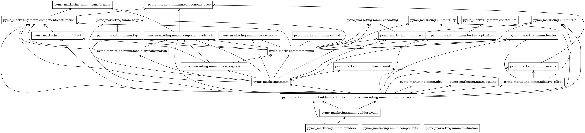

# Contributing

This document contains information about setting up a development environment for contributing to the project.

## Local Development

1. Clone the `pymc-marketing` repo locally and set this as your working directory.

2. Create conda environment. For example:

```shell
conda create -n pymc_marketing_env
```

3. Activate environment.

```shell
conda activate pymc_marketing_env
```

4. Install `pymc_marketing` package:

```shell
make init
```

5. To run tests:

```shell
make test
```

6. To check code style:

```shell
make check_lint
```

7. Set [pre-commit hooks](https://pre-commit.com/) (Optional):

```shell
pre-commit install
```

## Build the docs locally

```shell
make html
```

To delete all intermediate files and cached content and build the docs from scratch, run `make cleandocs` before `make html`

## Overview of the MMM codebase

Packages



Classes


## Overview of the CLV codebase

Packages


Classes


