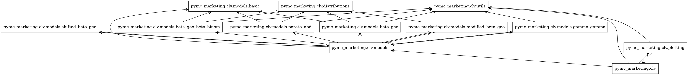
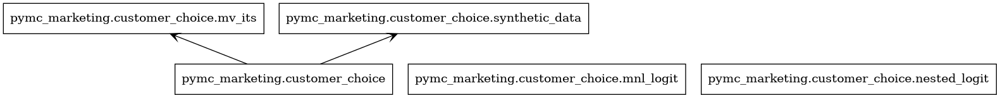
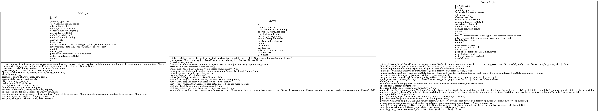
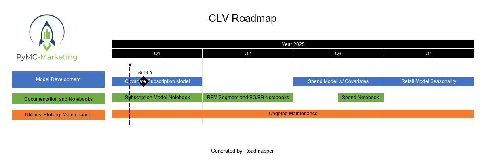

# Guidelines for Contributing

PyMC-Marketing welcomes contributions from interested individuals or groups. These guidelines are provided to give potential contributors information to make their contribution compliant with the conventions of the PyMC-Marketing project, and maximize the probability of such contributions to be merged as quickly and efficiently as possible. Contributors need not be experts, but should be interested in the project, willing to learn, and share knowledge.

There are 4 main ways of contributing to the PyMC-Marketing project (in ascending order of difficulty or scope):

1. Submitting issues related to bugs or desired enhancements.
2. Contributing or improving the documentation (docs) or examples.
3. Fixing outstanding issues (bugs) with the existing codebase. They range from low-level software bugs to higher-level design problems.
4. Adding new or improved functionality to the existing codebase.

Items 2-4 require setting up a local development environment, see [Local development steps](#Contributing-code-via-pull-requests) for more information.

## Opening issues
We appreciate being notified of problems with the existing PyMC-Marketing code. We prefer that issues be filed the on [Github Issue Tracker](https://github.com/pymc-labs/pymc-marketing/issues), rather than on social media or by direct email to the developers.

Please verify that your issue is not being currently addressed by other issues or pull requests by using the GitHub search tool to look for key words in the project issue tracker.

## Contributing code via pull requests

While issue reporting is valuable, we strongly encourage users who are inclined to do so to submit patches for new or existing issues via pull requests. This is particularly the case for simple fixes, such as typos or tweaks to documentation, which do not require a heavy investment of time and attention.

Contributors are also encouraged to contribute new code to enhance PyMC-Marketing's functionality, via pull requests.

The preferred workflow for contributing to PyMC-Marketing is to fork the GitHub repository, clone it to your local machine, and develop on a feature branch.

For more instructions see the [Pull request checklist](#pull-request-checklist)

## Local development steps

1. If you have not already done so, fork the [project repository](https://github.com/pymc-labs/pymc-marketing) by clicking on the 'Fork' button near the top right of the main repository page. This creates a copy of the code under your GitHub user account.

1. Clone your fork of the `pymc-marketing` repo from your GitHub account to your local disk, and add the base repository as a remote:

    ```bash
    git clone git@github.com:<your GitHub handle>/pymc-marketing.git
    cd pymc-marketing
    git remote add upstream git@github.com:pymc-labs/pymc-marketing.git
    ```

1. Create a feature branch (e.g. `my-feature`) to hold your development changes:

   ```bash
   git checkout -b my-feature
   ```

   Always use a feature branch. It's good practice to never routinely work on the `main` branch of any repository.

1. Create a dedicated development environment from the file present in the repo:

    ```bash
    conda env create -f environment.yml
    ```

    This will create an environment called `pymc-marketing-dev`. Activate the environment.

    ```bash
    conda activate pymc-marketing-dev
    ```

    Install the package (in editable mode) and its development dependencies:

    ```bash
    make init
    ```

    Set [pre-commit hooks](https://pre-commit.com/). First install pre-commit package (either `pip install pre-commit`, see the package's installation instructions). Alternatively you can run `make check_lint` which will install the `pre-commit` package. Then run this to set up the git hook scripts:

    ```bash
    pre-commit install
    ```

1. You can then work on your changes locally, in your feature branch. Add changed files using `git add` and then `git commit` files:

   ```bash
   git add modified_files
   git commit -m "Message summarizing commit changes"
   ```

   to record your changes locally.
   After committing, it is a good idea to sync with the base repository in case there have been any changes:

   ```bash
   git fetch upstream
   git rebase upstream/main
   ```

   Then push the changes to your GitHub account with:

   ```bash
   git push -u origin my-feature
   ```

1. [Optionally] Build the docs locally. If you have changed any of the documentation, you can build it locally to check that it looks as expected.

    ```bash
    make html
    ```

    To delete all intermediate files and cached content and build the docs from scratch, run `make cleandocs` before `make html`

1. Before you submit a Pull request, follow the [Pull request checklist](#pull-request-checklist).

1. Finally, to submit a pull request, go to the GitHub web page of your fork of the PyMC-Marketing repo. Click the 'Pull request' button to send your changes to the project's maintainers for review. This will send an email to the committers.

## Pull request checklist

We recommend that your contribution complies with the following guidelines before you submit a pull request:

- If your pull request addresses an issue, please use the pull request title to describe the issue and mention the issue number in the pull request description. This will make sure a link back to the original issue is created.

- All public methods must have informative docstrings with sample usage when appropriate.

- To indicate a work in progress please mark the PR as `draft`. Drafts may be useful to (1) indicate you are working on something to avoid duplicated work, (2) request broad review of functionality or API, or (3) seek collaborators.

- All other tests pass when everything is rebuilt from scratch.

- When adding additional functionality, either edit an existing example, or create a new example (typically in the form of a Jupyter Notebook) in the `pymc-marketing/docs/source/mmm` or `pymc-marketing/docs/source/clv` folders. Have a look at other examples for reference. Examples should demonstrate why the new functionality is useful in practice.

- Documentation and high-coverage tests are necessary for enhancements to be accepted.

- Documentation follows [NumPy style guide](https://numpydoc.readthedocs.io/en/latest/format.html)

- Run any of the pre-existing examples in `pymc-marketing/docs/source/*` that contain analyses that would be affected by your changes to ensure that nothing breaks. This is a useful opportunity to not only check your work for bugs that might not be revealed by unit test, but also to show how your contribution improves PyMC-Marketing for end users.

- Your code passes linting tests. Run the line below to check linting errors:

  ```bash
  make check_lint
  ```
- If you want to fix linting errors automatically, run

  ```bash
  make lint
  ```

- To run tests:

    ```bash
    make test
    ```

- To check code style:

    ```bash
    make check_format
    ```

- To fix code style automatically:

    ```bash
    make format
    ```

## Overview of the MMM codebase

Packages


Classes


## Overview of the CLV codebase

Packages



Classes


## Overview of the customer choice codebase

Packages



Classes



## 2025 CLV Roadmap



Review [task prioritization YAML](scripts/roadmaps/clv_tasks_priority.yaml) and open repo
[issues](https://github.com/pymc-labs/pymc-marketing/issues?q=is%3Aissue%20state%3Aopen%20label%3ACLV) to work on.

---

This guide takes some inspiration from the [Bambi guide to contributing](https://github.com/bambinos/bambi/blob/main/CONTRIBUTING.md)
