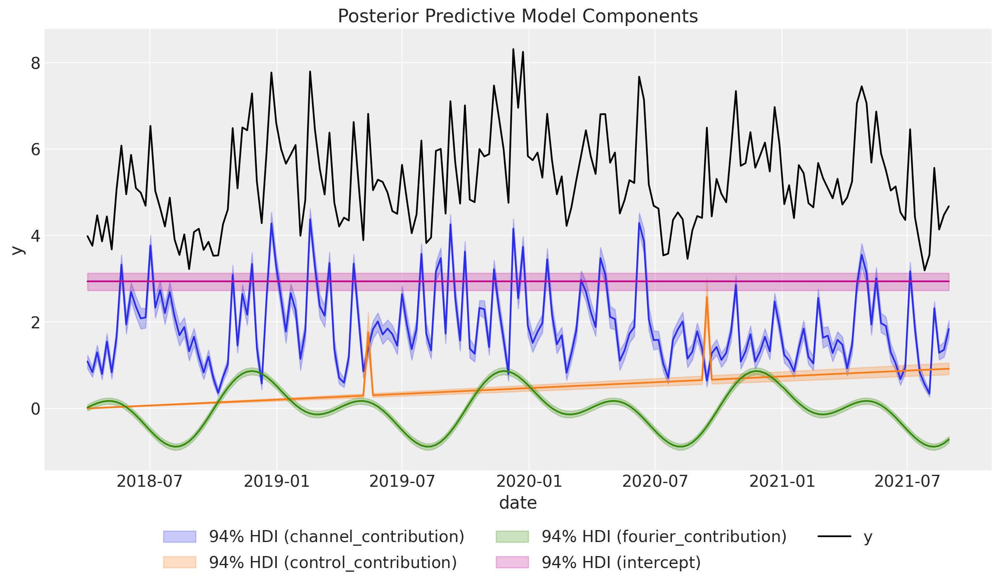
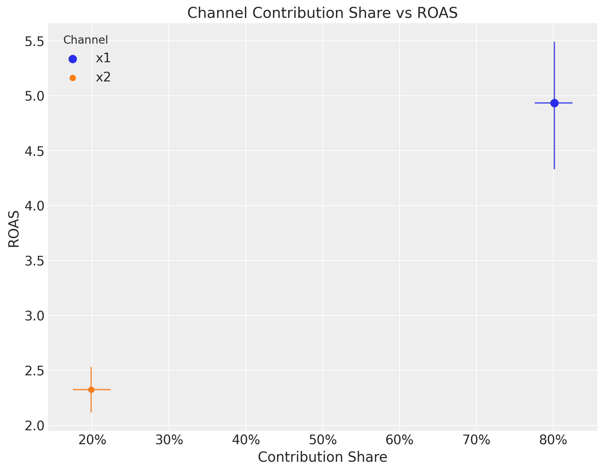
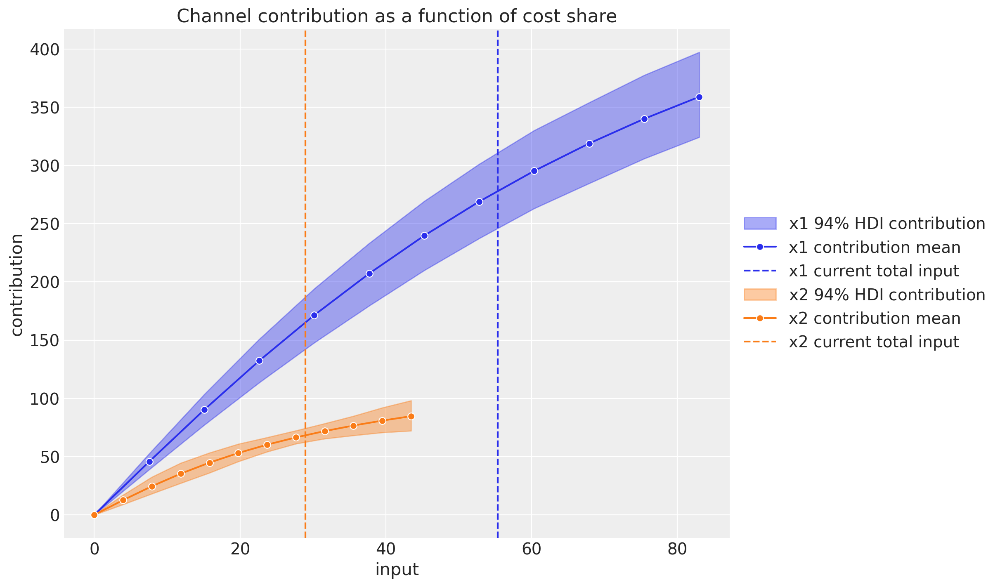
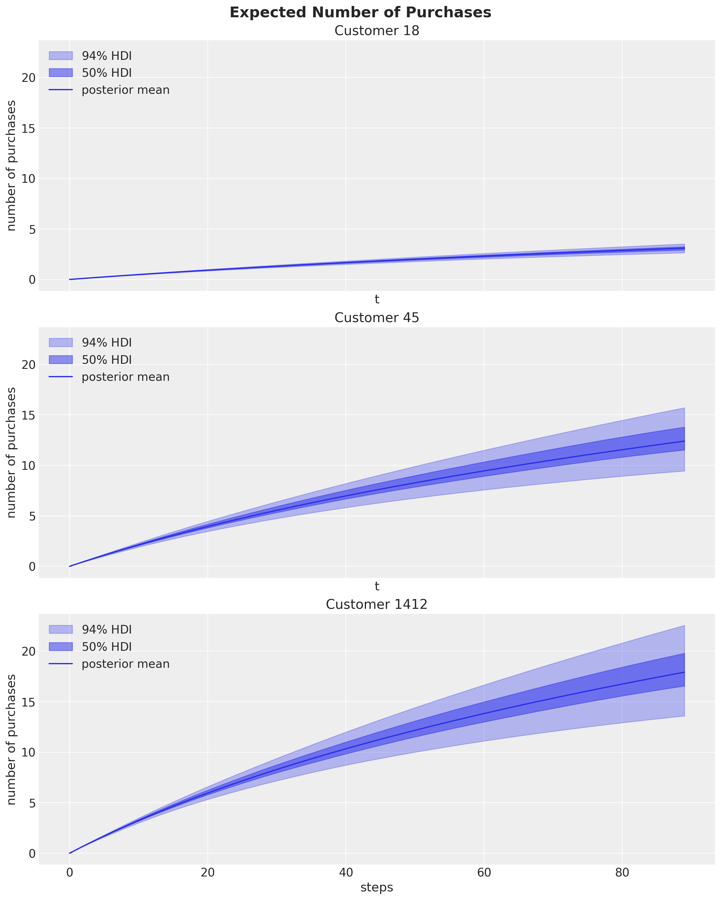
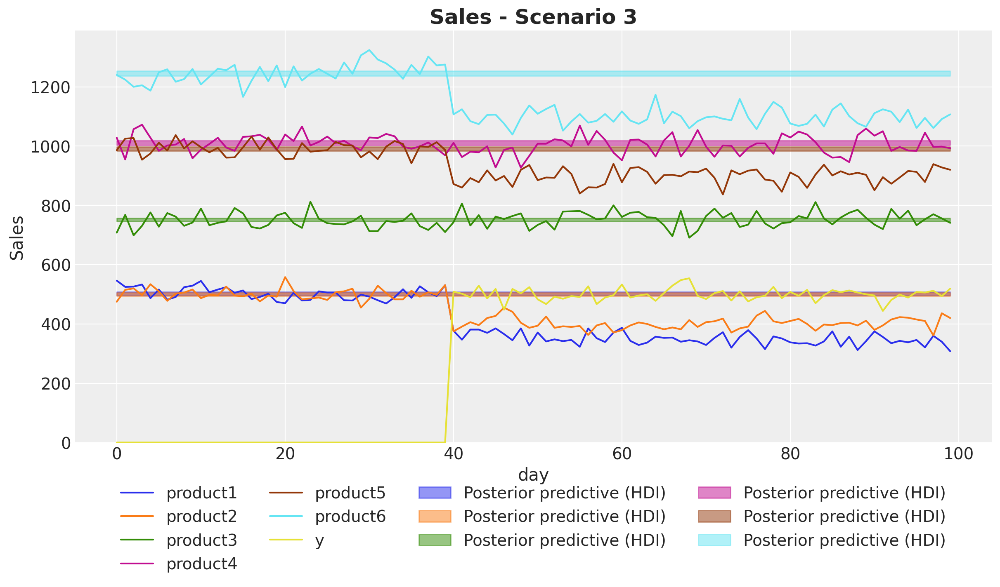
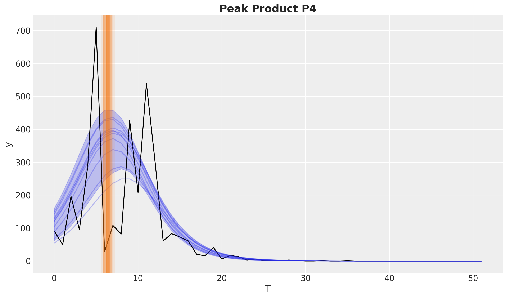
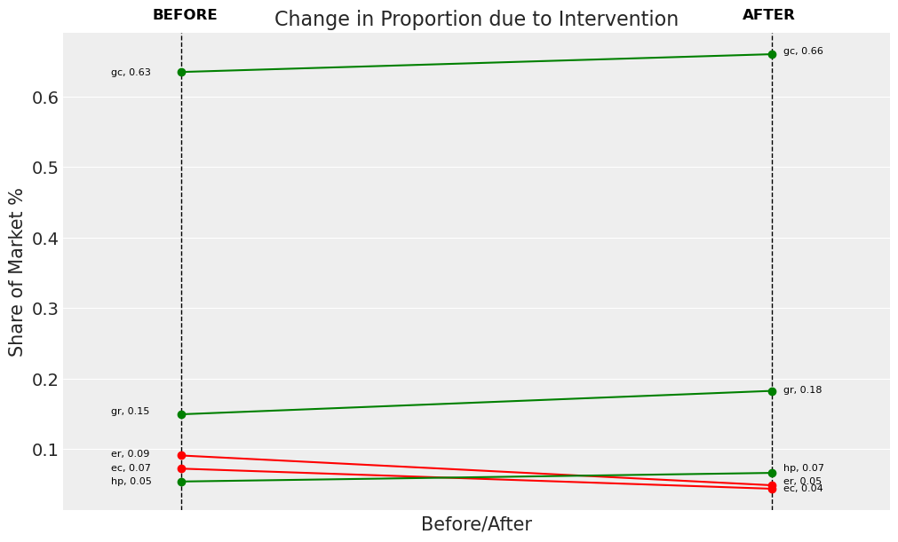

<div align="center">


</div>

----


[](https://codecov.io/gh/pymc-labs/pymc-marketing)
[](https://github.com/astral-sh/ruff)
[](https://docs.readthedocs.io/en/latest/)
[](https://pypi.python.org/pypi/pymc-marketing)

[](https://opensource.org/licenses/Apache-2.0)

# <span style="color:limegreen">PyMC-Marketing</span>: Bayesian Marketing Mix Modeling (MMM) & Customer Lifetime Value (CLV)

## Marketing Analytics Tools from [PyMC Labs](https://www.pymc-labs.com)

Unlock the power of **Marketing Mix Modeling (MMM)**, **Customer Lifetime Value (CLV)** and **Customer Choice Analysis (CSA)** analytics with PyMC-Marketing. This open-source marketing analytics tool empowers businesses to make smarter, data-driven decisions for maximizing ROI in marketing campaigns.

----

This repository is supported by [PyMC Labs](https://www.pymc-labs.com).

<center>
    
</center>

For businesses looking to integrate PyMC-Marketing into their operational framework, [PyMC Labs](https://www.pymc-labs.com) offers expert consulting and training. Our team is proficient in state-of-the-art Bayesian modeling techniques, with a focus on Marketing Mix Models (MMMs) and Customer Lifetime Value (CLV). For more information see [here](README.md#-schedule-a-free-consultation-for-mmm--clv-strategy).

Explore these topics further by watching our video on [Bayesian Marketing Mix Models: State of the Art](https://www.youtube.com/watch?v=xVx91prC81g).

### Community Resources

- [PyMC-Marketing Discussions](https://github.com/pymc-labs/pymc-marketing/discussions)
- [PyMC Discourse](https://discourse.pymc.io/)
- [Bayesian Discord server](https://discord.gg/swztKRaVKe)
- [MMM Hub Slack](https://www.mmmhub.org/slack)

## Quick Installation Guide

To dive into PyMC-Marketing, set up a specialized Python environment, `marketing_env`, via conda-forge:

```bash
conda create -c conda-forge -n marketing_env pymc-marketing
conda activate marketing_env
```

For a comprehensive installation guide, refer to the [official PyMC installation documentation](https://www.pymc.io/projects/docs/en/latest/installation.html).

### Docker

We provide a `Dockerfile` to build a Docker image for PyMC-Marketing so that is accessible from a Jupyter Notebook. See [here](scripts/docker/README.md) for more details.

## In-depth Bayesian Marketing Mix Modeling (MMM) in PyMC

Leverage our Bayesian MMM API to tailor your marketing strategies effectively. Leveraging on top of the research article [Jin, Yuxue, et al. “Bayesian methods for media mix modeling with carryover and shape effects.” (2017)](https://research.google/pubs/pub46001/),  and extending it by integrating the expertise from core PyMC developers, our API provides:

| Feature                                    | Benefit                                                                                                                                                                                                                                                                                                                                                                                 |
| ------------------------------------------ | --------------------------------------------------------------------------------------------------------------------------------------------------------------------------------------------------------------------------------------------------------------------------------------------------------------------------------------------------------------------------------------- |
| Custom Priors and Likelihoods              | Tailor your model to your specific business needs by including domain knowledge via prior distributions.                                                                                                                                                                                                                                                                                |
| Adstock Transformation                     | Optimize the carry-over effects in your marketing channels.                                                                                                                                                                                                                                                                                                                             |
| Saturation Effects                         | Understand the diminishing returns in media investments.                                                                                                                                                                                                                                                                                                                                |
| Customize adstock and saturation functions | You can select from a variety of adstock and saturation functions. You can even implement your own custom functions. See [documentation guide](https://www.pymc-marketing.io/en/stable/notebooks/mmm/mmm_components.html).                                                                                                                                                              |
| Time-varying Intercept                     | Capture time-varying baseline contributions in your model (using modern and efficient Gaussian processes approximation methods). See [guide notebook](https://www.pymc-marketing.io/en/stable/notebooks/mmm/mmm_time_varying_media_example.html).                                                                                                                                       |
| Time-varying Media Contribution            | Capture time-varying media efficiency in your model (using modern and efficient Gaussian processes approximation methods). See the [guide notebook](https://www.pymc-marketing.io/en/stable/notebooks/mmm/mmm_tvp_example.html).                                                                                                                                                        |
| Visualization and Model Diagnostics        | Get a comprehensive view of your model's performance and insights.                                                                                                                                                                                                                                                                                                                      |
| Causal Identification                      | Input a business driven directed acyclic graph to identify the meaningful variables to include into the model to be able to draw causal conclusions. For a concrete example see the [guide notebook](https://www.pymc-marketing.io/en/stable/notebooks/mmm/mmm_causal_identification.html).                                                                                             |
| Choose among many inference algorithms     | We provide the option to choose between various NUTS samplers (e.g. BlackJax, NumPyro and Nutpie). See the [example notebook](https://www.pymc-marketing.io/en/stable/notebooks/general/other_nuts_samplers.html) for more details.                                                                                                                                                     |
| GPU Support                                | PyMC's multiple backends allow for GPU acceleration.                                                                                                                                                                                                                                                                                                                                    |
| Out-of-sample Predictions                  | Forecast future marketing performance with credible intervals. Use this for simulations and scenario planning.                                                                                                                                                                                                                                                                          |
| Budget Optimization                        | Allocate your marketing spend efficiently across various channels for maximum ROI. See the [budget optimization example notebook](https://www.pymc-marketing.io/en/stable/notebooks/mmm/mmm_budget_allocation_example.html)                                                                                                                                                             |
| Experiment Calibration                     | Fine-tune your model based on empirical experiments for a more unified view of marketing. See the [lift test integration explanation](https://www.pymc-marketing.io/en/stable/notebooks/mmm/mmm_lift_test.html) for more details. [Here](https://www.pymc-marketing.io/en/stable/notebooks/mmm/mmm_roas.html) you can find a *Case Study: Unobserved Confounders, ROAS and Lift Tests*. |

### MMM Quickstart

```python
import pandas as pd

from pymc_marketing.mmm import (
    GeometricAdstock,
    LogisticSaturation,
    MMM,
)
from pymc_marketing.paths import data_dir

file_path = data_dir / "mmm_example.csv"
data = pd.read_csv(file_path, parse_dates=["date_week"])

mmm = MMM(
    adstock=GeometricAdstock(l_max=8),
    saturation=LogisticSaturation(),
    date_column="date_week",
    channel_columns=["x1", "x2"],
    control_columns=[
        "event_1",
        "event_2",
        "t",
    ],
    yearly_seasonality=2,
)
```

Initiate fitting and get insightful plots and summaries. For example, we can plot the components contributions:

```python
X = data.drop("y", axis=1)
y = data["y"]
mmm.fit(X, y)
mmm.plot_components_contributions()
```



You can compute channels efficienty and compare them with the estimated return on ad spend (ROAS).

<center>
    
</center>

Once the model is fitted, we can further optimize our budget allocation as we are including diminishing returns and carry-over effects in our model.

<center>
    
</center>

- Explore a hands-on [simulated example](https://pymc-marketing.readthedocs.io/en/stable/notebooks/mmm/mmm_example.html) for more insights into MMM with PyMC-Marketing.
- Get started with a complete end-to-end analysis: from model specification to budget allocation. See the [guide notebook](https://www.pymc-marketing.io/en/stable/notebooks/mmm/mmm_case_study.html).

### Essential Reading for Marketing Mix Modeling (MMM)

- [Bayesian Media Mix Modeling for Marketing Optimization](https://www.pymc-labs.com/blog-posts/bayesian-media-mix-modeling-for-marketing-optimization/)
- [Improving the Speed and Accuracy of Bayesian Marketing Mix Models](https://www.pymc-labs.com/blog-posts/reducing-customer-acquisition-costs-how-we-helped-optimizing-hellofreshs-marketing-budget/)
- [Johns, Michael and Wang,  Zhenyu. "A Bayesian Approach to Media Mix Modeling"](https://www.youtube.com/watch?v=UznM_-_760Y)
- [Orduz, Juan. "Media Effect Estimation with PyMC: Adstock, Saturation & Diminishing Returns"](https://juanitorduz.github.io/pymc_mmm/)
- [A Comprehensive Guide to Bayesian Marketing Mix Modeling](https://1749.io/learn/f/a-comprehensive-guide-to-bayesian-marketing-mix-modeling)

### Explainer App: Streamlit App of MMM Concepts

Dynamic and interactive visualization of key Marketing Mix Modeling (MMM) concepts, including adstock, saturation, and the use of Bayesian priors. This app aims to help marketers, data scientists, and anyone interested in understanding MMM more deeply.

**[Check out the app here](https://pymc-marketing-app.streamlit.app/)**

## Unlock Customer Lifetime Value (CLV) with PyMC

Understand and optimize your customer's value with our **CLV models**. Our API supports various types of CLV models, catering to both contractual and non-contractual settings, as well as continuous and discrete transaction modes.

- [CLV Quickstart](https://www.pymc-marketing.io/en/stable/notebooks/clv/clv_quickstart.html)
- [BG/NBD model](https://www.pymc-marketing.io/en/stable/notebooks/clv/bg_nbd.html)
- [Pareto/NBD model](https://www.pymc-marketing.io/en/stable/notebooks/clv/pareto_nbd.html)
- [Gamma-Gamma model](https://www.pymc-marketing.io/en/stable/notebooks/clv/gamma_gamma.html)
- [Shifted Beta-Geo model](https://www.pymc-marketing.io/en/stable/notebooks/clv/sBG.html)
- [Modified BG/NBD model](https://www.pymc-marketing.io/en/stable/notebooks/clv/mbg_nbd.html)

### Examples

|                | **Non-contractual**      | **Contractual**         |
| -------------- | ------------------------ | ----------------------- |
| **Continuous** | online purchases         | ad conversion time      |
| **Discrete**   | concerts & sports events | recurring subscriptions |

### CLV Quickstart

```python
import matplotlib.pyplot as plt
import pandas as pd
import seaborn as sns
from pymc_marketing import clv
from pymc_marketing.paths import data_dir

file_path = data_dir / "clv_quickstart.csv"
data = pd.read_csv(data_path)
data["customer_id"] = data.index

beta_geo_model = clv.BetaGeoModel(data=data)

beta_geo_model.fit()
```

Once fitted, we can use the model to predict the number of future purchases for known customers, the probability that they are still alive, and get various visualizations plotted.



See the Examples section for more on this.

## Customer Choice Analysis with PyMC-Marketing

Analyze the impact of new product launches and understand customer choice behavior with our **Multivariate Interrupted Time Series (MVITS)** models. Our API supports analysis in both saturated and unsaturated markets to help you:

| Feature                     | Benefit                                                           |
| --------------------------- | ----------------------------------------------------------------- |
| Market Share Analysis       | Understand how new products affect existing product market shares |
| Causal Impact Assessment    | Measure the true causal effect of product launches on sales       |
| Saturated Market Analysis   | Model scenarios where total market size remains constant          |
| Unsaturated Market Analysis | Handle cases where new products grow the total market size        |
| Visualization Tools         | Plot market shares, causal impacts, and counterfactuals           |
| Bayesian Inference          | Get uncertainty estimates around all predictions                  |

### Customer Choice Quickstart

```python
import pandas as pd
from pymc_marketing.customer_choice import MVITS, plot_product

# Define existing products
existing_products = ["competitor", "own"]

# Create MVITS model
mvits = MVITS(
    existing_sales=existing_products,
    saturated_market=True, # Set False for unsaturated markets
)

# Fit model
mvits.fit(X, y)

# Plot causal impact on market share
mvits.plot_causal_impact_market_share()

# Plot counterfactuals
mvits.plot_counterfactual()
```

<center>
    
</center>

See our example notebooks for [saturated markets](https://www.pymc-marketing.io/en/stable/notebooks/customer_choice/mv_its_saturated.html) and [unsaturated markets](https://www.pymc-marketing.io/en/stable/notebooks/customer_choice/mv_its_unsaturated.html) to learn more about customer choice modeling with PyMC-Marketing.

## Bass Diffusion Model

The Bass Diffusion Model is a popular model for predicting the adoption of new products. It is a type of product life cycle model that describes the market penetration of a new product as a function of time. PyMC-Marketing provides a flexible implementation of the Bass Diffusion Model, allowing you to customize the model parameters and fit the model to your specific data (many products).

<center>
    
</center>

## Discrete Choice Models

Discrete choice models come in various forms, but each aims to show how choosing between a set of alternatives can be understood as a function of the observable attributes of the alternatives at hand. This type of modelling drives insight into the "must-have" features of a product, and can be used to assess the success or failure of product launches or re-launches. The PyMC-marketing implementation offers a formula based model specification, for estimating the relative utility of each good in a market and identifying their most important features.

<center>
    
</center>


## Why PyMC-Marketing vs other solutions?

PyMC-Marketing is and will always be free for commercial use, licensed under [Apache 2.0](LICENSE). Developed by core developers behind the popular PyMC package and marketing experts, it provides state-of-the-art measurements and analytics for marketing teams.

Due to its open-source nature and active contributor base, new features are constantly added. Are you missing a feature or want to contribute? Fork our repository and submit a pull request. If you have any questions, feel free to [open an issue](https://github.com/pymc-labs/pymc-marketing/issues).

### Thanks to our contributors!

[](https://github.com/pymc-labs/pymc-marketing/graphs/contributors)


## Marketing AI Assistant: MMM-GPT with PyMC-Marketing

Not sure how to start or have questions? MMM-GPT is an AI that answers questions and provides expert advice on marketing analytics using PyMC-Marketing.

**[Try MMM-GPT here.](https://mmm-gpt.com/)**

## 📞 Schedule a Free Consultation for MMM & CLV Strategy

Maximize your marketing ROI with a [free 30-minute strategy session](https://calendly.com/niall-oulton) with our PyMC-Marketing experts. Learn how Bayesian Marketing Mix Modeling and Customer Lifetime Value analytics can boost your organization by making smarter, data-driven decisions.

We provide the following professional services:

- **Custom Models**: We tailor niche marketing analytics models to fit your organization's unique needs.
- **Build Within PyMC-Marketing**: Our team members are experts leveraging the capabilities of PyMC-Marketing to create robust marketing models for precise insights.
- **SLA & Coaching**: Get guaranteed support levels and personalized coaching to ensure your team is well-equipped and confident in using our tools and approaches.
- **SaaS Solutions**: Harness the power of our state-of-the-art software solutions to streamline your data-driven marketing initiatives.
