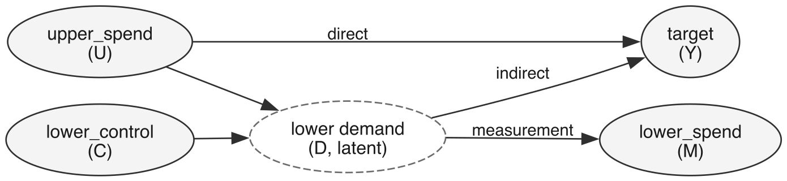
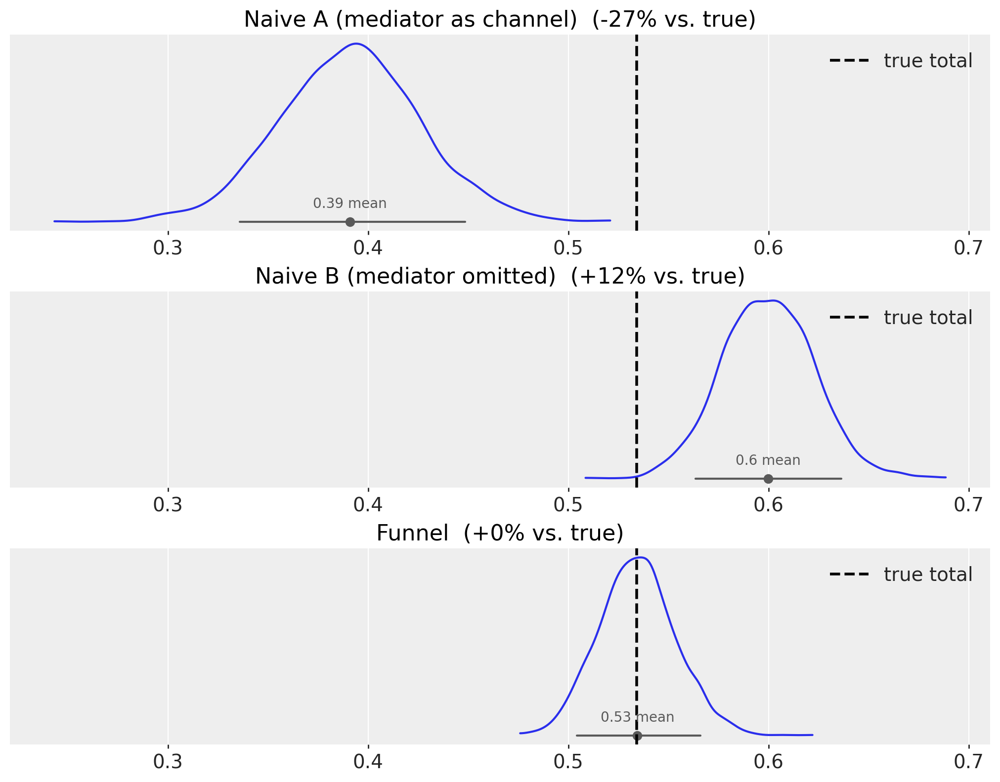
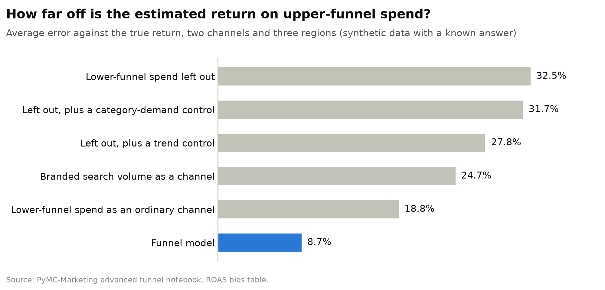
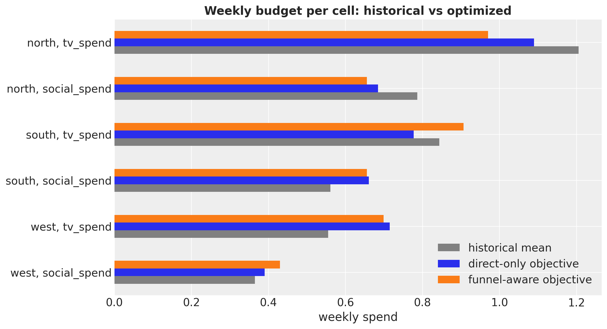

# Why Your Marketing Mix Model Should See the Funnel

*How PyMC-Marketing models the demand TV creates for search, and why your budget optimizer needs to know.*

## The search team gets the credit

Ask a last-touch attribution report which channel drove last quarter's leads and it will point at paid search. Ask a standard marketing mix model (MMM) and, more often than you would expect, it agrees. Both book the conversion to the channel that closed it. But upper-funnel media (TV, video, social) create demand that surfaces weeks later as branded searches and paid-search clicks. Search gets the credit. Brand gets the questions.

In this post we want to understand why your marketing mix model should see the funnel, what it costs when it does not, and what changes when it does. To show this we use synthetic data, data we generated from a known funnel, so that every model can be scored against the truth. PyMC-Marketing now has an extension point that lets a model carry this kind of structure, and two notebooks build a funnel component on it: a [minimal example](https://www.pymc-marketing.io/en/latest/notebooks/mmm/mmm_funnel_mueffect.html) and an [advanced, geo-level example with budget optimization](https://www.pymc-marketing.io/en/latest/notebooks/mmm/mmm_funnel_mueffect_advanced.html). All details, code, and diagnostics live there. This post tells the story.

## Three ways an MMM gets the funnel wrong

Almost every MMM that has both TV and paid search in its data does one of three things with the lower funnel.

**It puts lower-funnel spend next to TV as an ordinary channel.** This is the default configuration. The model then reports only TV's direct effect on sales. The demand TV created downstream, which converted through search, is booked to search.

**It leaves lower-funnel spend out.** Sometimes a seasonality or trend control is added to compensate. TV then absorbs the market movements that also drive the lower funnel, and the demand it genuinely created is misallocated across channels. A control can fix the first problem but not the second. In both examples below the net result was over-crediting, but the direction is not guaranteed.

**It puts a tracking metric in as a channel.** Branded search volume correlates beautifully with sales, arrives weekly, and is free. It also causes nothing: people search for the brand because they are already in the market. Putting it in the channel list partially blocks the very effect you are trying to measure. The test is simple: if you doubled it, would sales move? A spend line passes; a tracking metric does not.

The business consequence is the same in all three cases. The return on ad spend (ROAS) numbers that drive budget reallocations are biased, and nothing in the model output says in which direction.

## The smallest example that shows it

The first notebook keeps the funnel as small as it can be while still being a funnel:

- one upper-funnel channel;
- a pool of lower-funnel demand that nobody observes directly;
- observed lower-funnel spend that tracks that pool (think paid search);
- an independent driver of lower-funnel demand, such as auction pressure or category demand;
- the sales target.

*Upper-funnel spend reaches sales two ways: directly, and by creating lower-funnel demand that converts. Observed lower-funnel spend is our window onto that demand. Node labels are the notebook's variable names.*

We built the example so that about a third of the upper-funnel effect flows through the funnel. Then we fit three models to the same data: lower-funnel spend as an ordinary channel, lower-funnel spend left out, and a model that sees the funnel.

How does the model see the funnel? A standard MMM adds up channel contributions to explain sales. PyMC-Marketing lets you plug one more term into that sum (the library calls this a MuEffect), and the funnel component uses that plug-in to add a second equation: how much lower-funnel demand the upper funnel creates, checked against the lower-funnel spend we actually observe. One model explains two data series instead of one. The notebook shows the whole component in a few dozen lines.

*Top to bottom: treat lower-funnel spend as a channel and the upper funnel is under-credited by 27%; leave it out and the upper funnel is over-credited by 12%; model the funnel and the estimate lands on the truth (dashed line).*

Could you have caught this from model fit? Only half of it. Leaving lower-funnel spend out did show up as a worse fit. But the most biased model, lower-funnel spend as a channel, fit the sales series as well as the correct model in sample and slightly better out of sample. Fit is an unreliable alarm.

One note on this toy example: here lower-funnel spend only measures demand and is not a budget lever. Real paid search is money that converts, which is what the next example adds.

## Closer to reality: two channels, three regions, and search as real money

The second notebook scales the idea up to something closer to production work. TV and social feed one shared pool of demand across three regions. Lower-funnel spend is paid search that converts and has its own budget line: part of it responds to the demand the upper funnel creates, part follows the search team's own calendar. Branded search volume is in the data too; it tracks demand but buys nothing. And media budgets rise and fall with the market, as they do in real life.

*Follow the pink nodes (TV, social) to the green target: one arrow goes straight there, the other runs through demand and paid search. Branded search (dashed link) is a symptom of demand, not a lever. Grey nodes are the market background: season, trend, category demand, and the search team's own budget.*

Before fitting anything, the notebook interrogates the causal diagram above. Every specification is a choice of which series go into the model, and the diagram says what each choice does. Two checks matter. First, does the model include something that sits downstream of the media, such as paid search or branded search volume? If so, it cuts into the effect it is trying to measure and answers a different question: the direct effect of the media, not their total effect. Second, does it leave a backdoor path open, that is, a route from the media to sales that runs through the market (season, trend, category demand) rather than through anything the media did? If so, market movements get booked as media effects. Two of the five conventional specifications fail the first check, one fails the second, one passes only under an extra assumption about hidden market noise, and only one, the category-demand control, is formally valid for the total effect. Even that one misses the true return by about a third in the chart below: a valid set of controls says which variables you need, not how they must enter the model, and no set of controls can represent the demand pool that the media share.

The funnel model is identified in a different way. It does not pick controls; it writes down the structure the diagram shows: how demand is created, how it turns into paid search, and which variables enter which equation. This is why the causal analysis cannot be skipped when working with funnels. It tells you which question each model actually answers, which assumptions the funnel model rests on, and which of those assumptions can be checked on the data before any model is fit. The notebook runs every one of these checks in code.

Six specifications were then fit to this one dataset: the three ways of getting it wrong from above (leaving lower-funnel spend out appears three times: plain, with a category-demand control, and with a trend control) and the funnel model. Because the data are synthetic, each can be scored against the true return on TV and social spend in every region.

*Average error of the estimated return on upper-funnel spend (two channels, three regions), scored against the true total return. Every conventional specification misses by 19% to 33%, each in its own direction; the funnel model misses by under 9%.*

Two details matter. A simple trend control repaired the part of TV's error that came from TV moving with the market. But no control can recover demand that flows through a funnel the model does not represent: the same model's estimate for social got worse. Without any control, one regional estimate for social was off by 88%.

And fit does not warn you. All six models sit within one point of R² of each other while their ROAS conclusions differ by tens of percent. Goodness-of-fit may catch a missing variable; it cannot catch a wrong causal story. In a simulation we can check every model against the truth. In production nobody can, so a good fit is never by itself a reason to trust a model. Trust has to come from elsewhere: from a causal structure that matches how your funnel actually works, from checks against experiments where you have them, and from predictions that hold up when the plan changes.

## Pricing the funnel in the budget

Measurement is half the job; the reason to measure is to decide where the money goes.

We put the fitted funnel model through PyMC-Marketing's budget optimizer (same total weekly budget, realistic bounds per region and channel, optimized over the fitted period) and ran it twice. The default objective counts only each channel's direct effect on sales. The funnel-aware objective also counts the demand the media create downstream; in the notebook that is a one-argument change. By construction about a third of each channel's effect runs through the funnel, so an optimizer that ignores it is blind to roughly a third of what the media deliver.

*Same total budget, same fitted model, two objectives. The plans agree on five of six region-channel cells. For TV in the south region the default objective cuts the budget by 8% while the funnel-aware objective grows it by 7%. Labels read region, channel.*

Why do the plans differ, and why does TV in the south flip? The mechanics are the same for any optimizer that has a fixed total to spend. What matters is not how much a cell returns in total, but what the next dollar in that cell returns. Call it the next-dollar return. With diminishing returns, the next dollar earns less in a cell that already spends a lot and more in a cell that spends little. The optimizer takes money from the cells where the next dollar earns least and gives it to the cells where it earns most, and it stops when the next dollar earns the same everywhere. That common level is the bar every cell is measured against: a cell whose next dollar earns less than the bar is cut, and a cell whose next dollar earns more is grown.

The chart below shows the next-dollar return of each of the six cells at the historical plan, split into two parts. The blue part is what the extra dollar earns directly. The orange part is what it earns through the funnel: the search demand it creates, converted by the region's lower funnel. The two dashed lines are the two bars. The default objective sees only the blue part, so it measures each cell's blue bar against the blue line. The funnel-aware objective sees the full bar and measures it against the orange line, which sits higher because it counts more return per dollar.

*The next dollar's return per region and channel at the historical plan, split into the direct part (blue) and the part that travels through the funnel (orange). The dashed lines are the levels the two optimizers settle at. The blue part is all the default objective sees: between 56% and 72% of the total, depending on the cell. Labels read region, channel.*

Now the plans read off the chart. Both cells in the north fall short of both lines, so both optimizers cut them: the north already spends the most, and its lower funnel is the busiest of the three regions, so extra demand pushed into it converts at a lower rate. Both cells in the west and social in the south clear both lines, so both optimizers grow them. TV in the south is the one cell that straddles the lines. Its blue part falls short of the blue line, so the default objective cuts it. Its full bar clears the orange line, so the funnel-aware objective grows it. The difference is the orange part, which is twice as large as for TV in the north. A dollar of TV in the south creates more search demand than a dollar in the north, because the south is a smaller market and the same money goes further there. And the south's lower funnel converts that demand at a better rate, because it is further from its ceiling than the north's. The default objective cannot see either fact. The funnel-aware objective sees both, and a cut becomes an increase.

What did it buy? On this one synthetic dataset the funnel-aware plan did slightly better against the known truth (about +0.5% versus +0.4% in media-driven sales), before paying for the extra lower-funnel spend the new demand triggers. The gains are about one percent because the historical plan was already close to optimal, and the model's own estimate of them is optimistic by roughly half. The lesson is not the size of the gain but where the money goes.

The notebook also shows how to let the optimizer decide the lower-funnel budget itself, alongside the media. That is the decision every team faces when paid search runs under a budget cap: raise the upper funnel without raising the cap, and part of the new demand is wasted.

## Takeaways

- Lower-funnel spend next to upper-funnel spend as an ordinary channel: the upper funnel is under-credited.
- Lower-funnel spend left out: the upper funnel absorbs what it should not, and a control fixes only the part that moves with the market.
- Tracking metrics are not channels. Ask whether doubling one would move sales.
- Goodness-of-fit may catch a missing variable; it cannot catch a wrong causal story.
- Once the funnel is in the model, the optimizer must be told to count it.

Three caveats keep these results honest.

1. The data are synthetic and generated from the same structure the funnel model fits, so the funnel model is handed the truth; on real data the structure has to be argued (which series are causes, which are indicators, whether the search budget has variation of its own).
2. The budget results are in-sample on one dataset; the point is the direction of the moves, not the percentages.
3. The funnel component is notebook code on a PyMC-Marketing extension point, not yet a shipped feature, and part of its edge is that it uses more data than any of the conventional models.

## The impact on your marketing optimization strategy

Why go to this trouble? Because a model that sees the funnel changes three things you can do with it.

- **Better channel attribution.** Upper-funnel channels get credit for the demand they create downstream, and lower-funnel channels keep only the credit they earn. The ROAS that drives your budget conversation then answers the question you asked, the total effect of each channel, rather than a question nobody asked.
- **Media optimization that prices the whole funnel.** The optimizer can be told to count the demand media create downstream, and it can decide the lower-funnel budget alongside the media instead of treating it as fixed. When paid search runs under a cap, the two decisions belong together.
- **What-if scenarios that propagate through the funnel.** Because the funnel is written into the model as structure rather than fitted as a correlation, you can intervene anywhere in it and follow the consequences: raise TV by 20% and the model tells you how much search demand that creates, how much search budget it will need, and what it does to sales. Any change you can draw on the diagram, the model can evaluate. That is counterfactual and intervention analysis with the whole funnel in view.

None of this is a silver bullet. A funnel model is one instrument in a measurement toolkit, and PyMC-Marketing is built as that toolkit. The same model can be calibrated against lift tests and geo experiments ([lift-test calibration](https://www.pymc-marketing.io/en/latest/notebooks/mmm/mmm_lift_test.html)). The brand side of the funnel, where media build awareness and consideration that turn into baseline sales over months, has its own worked example ([long-term brand effects with brand metrics](https://www.pymc-marketing.io/en/latest/notebooks/mmm/mmm_brand_metrics_long_term.html)). Each method covers a blind spot of the others; the funnel model covers the one between upper- and lower-funnel media.

A few months ago, measurement of this kind was the preserve of specialist teams and academic papers. Today the building blocks sit in an open-source package, with documentation, worked examples such as the two notebooks above, and a community to ask when something does not fit. That is the point of PyMC-Marketing: to make these methods available to every team that has the data and the questions, not only to those who can hire the specialists. Of course, at PyMC Labs we are always happy to help with bespoke work.

## Where to go next

The two notebooks hold everything this post left out: code, diagnostics, parameter recovery, and the formal causal analysis. Start with the [minimal funnel](https://www.pymc-marketing.io/en/latest/notebooks/mmm/mmm_funnel_mueffect.html) and continue with the [geo-level funnel and budget optimization](https://www.pymc-marketing.io/en/latest/notebooks/mmm/mmm_funnel_mueffect_advanced.html). For the same ideas in production, read the Nürnberger Versicherung case study by PyMC Labs: a bespoke funnel-aware MMM for an insurance client, with lower-funnel spend as both an outcome of upper-funnel activity and a driver of leads, and search caps optimized together with media ([Part I](https://www.pymc-labs.com/blog-posts/funnel-aware-mmm), [Part II](https://www.pymc-labs.com/blog-posts/full-funnel-mmm-optimization), [Part III](https://www.pymc-labs.com/blog-posts/extending-funnel-aware-bayesian-marketing-mix-model)). The client reported a cost per lead down by more than a quarter.

Bring these methods to your organisation. [Talk to the team that built the tools](https://www.pymc-labs.com/contact).
