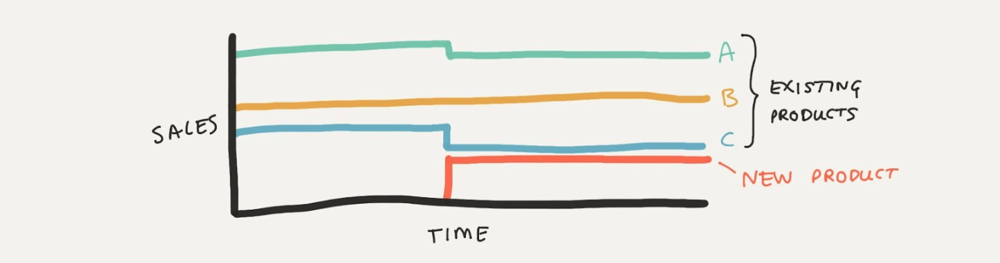

# Introduction to causal product incrementality analysis

Let's say your company sells many products into a busy market with many competitors. Over time, both you and your competitors have been releasing new products and discontinuing old ones. Your goal, depending on your company’s strategy, might be to increase market share, sales volume, or profit margins.

One way this is typically done is by releasing new products that you believe will appeal to customers more than your competitors’ products. But how do you know if your new products are successful? If your new product sells, those sales could be coming from a variety of sources:
* **Market growth**: These are sales that come from new customers entering the market. This would be a desirable outcome.
* **Incremental sales**: These are sales that come from customers who would have bought a competitor’s product if you hadn’t released your new product. This is also a good outcome.
* **Cannibalistic sales**: These sales have come from customers who would have bought one of your existing products if you hadn’t released your new product. So while the new product's sales are non-zero, they are cannibalizing sales from your existing products.

So we can imagine a busy marketplace of products, where each product has a certain number of sales. We also have many new products being released and old products being discontinued.

In an effort to understand where sales are coming from we may have purchased retail sales data which gives us time series data on the sales of all products in the market. But how can we use this data to understand where our sales are coming from?

If we can do this, then we could gain valuable insights that could inform our company’s product portfolio decisions. For example, we could:
* Understand which products are driving market growth
* Understand which products are incremental, taking sales from competitors
* Understand which products are cannibalizing sales from other products

We might be tempted to think of cannibalistic sales as 'bad'. But this need not be the case, it depends entirely on your product strategy. For example, it could be that you want to constantly improve your product line up, releasing products with better attributes which are superior to competitors. In this case, you would expect sales of older products to decrease as customers switch to the new products. This can be a desirable outcome.

## Causal inference in product incrementality

Let's develop the basic logic behind a causal understanding of product incrementality. We will use a simple example to illustrate the key concepts.

In the plot below we have a period of time before we release a new product. We can see that sales of products A, B, and C are stable (yes this is a simplification!). But half way through our time period we release a new product and we can see that it sells reasonable volumes. The question is, where are these sales coming from?

In this simplified example we could look at how the sales of existing products change, and infer where the sales of the new products came from. In this case we can see that the sales of product A and C have decreased (right at the time of the new product introduction) and so we could reasonably claim that the sales of the new product are cannibalizing sales from products A and C.

To be more precise, we aren't really able to make this causal inference based on the sales data _before_ new product introduction. Instead, we do it by comparing the actual product sales after the new product introduction to a counterfactual scenario where the new product was not introduced. This is the essence of causal inference in product incrementality. The question is how do we calculate the counterfactual sales?

In the trivially simple example above where sales are highly stable over time, we can do this with simple visual extrapolation. But in the real world, sales data will be noisy, exhibit seasonality, perhaps with some underlying trend, changes in prices, and marketing campaigns by you and your competitors and so on.

In fact, in many markets it is likely even more complex. We might not be able to neatly isolate time periods around new product introductions. We might have multiple new products being introduced at the same (or nearly the same) time.

All of this added complexity will make it non-trivial to infer the causal impact of new products on existing products. The complexity of the product environment will need to be matched by a causal modeling strategy that can handle this complexity.
