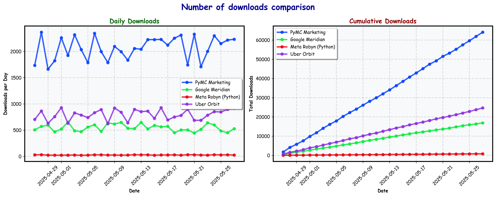

# How We Compare

Given the popularity of the Media Mix Modelling (MMM) approach, numerous packages are available. Below is a concise comparison highlighting how the features of PyMC-Marketing stand against other popular options:

| Feature                       | PyMC-Marketing | Robyn          | Orbit KTR | Meridian*               |
|-------------------------------|:--------------:|:--------------:|:---------:|:----------------------:|
| **Language**                  | Python         | R              | Python    | Python                 |
| **Approach**                  | Bayesian       | Traditional ML | Bayesian  | Bayesian               |
| **Foundation**                | PyMC           | -              | STAN/Pyro | TensorFlow Probability |
| **Company**                   | PyMC Labs      | Meta           | Uber      | Google                 |
| **Open source**               | ✅              | ✅              | ✅         | ✅                      |
| **Out-of-Sample Forecasting** | ✅              | ❌              | ✅         | ❌                      |
| **Budget Optimizer**          | ✅              | ✅              | ❌         | ✅                      |
| **Time-Varying Intercept**    | ✅              | ❌              | ✅         | ✅                      |
| **Time-Varying Coefficients** | ✅              | ❌              | ✅         | ❌                      |
| **Custom Priors**             | ✅              | NA              | ❌         | ✅                      |
| **Custom Model Terms**        | ✅              | ❌              | ❌         | ❌                      |
| **Lift-Test Calibration**     | ✅              | ✅              | ❌         | ✅                      |
| **Hierachical Geographic Modeling**       | ✅              | ❌              | ❌         | ✅                      |
| **Standardized Database Connectors** | ✅ (with Fivetran) | ❌ | ✅ | ✅ (limited to Google ecosystem) |
| **Unit-Tested**               | ✅              | ❌              | ✅         | ✅                      |
| **MLFlow Integration**       | ✅              | ❌              | ❌         | ✅                      |
| **Multiple Sampling Backends**| ✅              | NA               | ❌         | ✅                      |
| **GPU Sampling Acceleration**| ✅              | NA               | ❌         | ✅                      |
| **Consulting Support**        | Provided by Authors | Third-party agency | Third-party agency | Third-party agency |

*\*Meridian has been released as successor of Lightweight-MMM, which has been deprecated by Google*

Last updated: 2025-10-17

---
### Key Takeaway
Four of the five major libraries for MMMs implement different flavors of Bayesian models. While they share a broadly similar statistical foundation, they differ in API flexibility, underlying technology stack, and implementation approach.

PyMC-Marketing stands out as the most widely used library by PyPI downloads (see plot below), offering unmatched flexibility and a comprehensive set of advanced features. This makes it ideal for teams looking for a highly customizable, state-of-the-art solution. Its breadth and depth open the door to deeper understanding and mastery for those willing to explore its full capabilities.

However, other libraries have their own strengths — for example, Robyn is popular in the R community and provides extensive tutorials and documentation.

Your optimal choice should depend primarily on:

1. Your team's technical expertise
2. Your primary advertising channels
3. Preference for an independent open-source solution vs. one sponsored by Ad Networks

## Detailed Performance Benchmark

When it comes to Bayesian Media Mix Modeling the two most used options are PyMC-Marketing and Google Meridian. Our comprehensive technical benchmark comparing PyMC-Marketing against Google Meridian across realistic datasets (from startup to enterprise scale) reveals PyMC-Marketing's superior performance: **2-20x faster sampling**, **40% lower error** in channel contribution estimates, and **successful scaling** to large enterprise datasets where Meridian fails to converge. PyMC-Marketing's flexible sampling backends (NumPyro, BlackJAX, Nutpie) provide significant advantages over Meridian's fixed TensorFlow Probability implementation. See our [detailed benchmark analysis](https://www.pymc-labs.com/blog-posts/pymc-marketing-vs-google-meridian) for complete results and open-source methodology.

## Our Recommendation

### Choose Meta Robyn if:

- Your team primarily uses R instead of Python
- You prefer a simpler but less rigorous approach  than Bayesian Models (Ridge regression)
- You want direct integration with Meta/Facebook advertising data

### Choose Google Meridian if:

- You want a simplified (albeit less flexible) API to build models across geographies
- Direct integration with the Google advertising ecosystem is important
- You can allow for reduced predictive accuracy and explainability

### Choose PyMC-Marketing if:

- Maximum flexibility for complex, unique business requirements is necessary
- You need advanced statistical modeling capabilities (e.g., Gaussian Processes)
- Production ready setup and integration into broader data science workflows is important (MLflow)
- You prefer independence from major ad publishers and networks
- Professional independent consulting support is desirable info@pymc-labs.com
