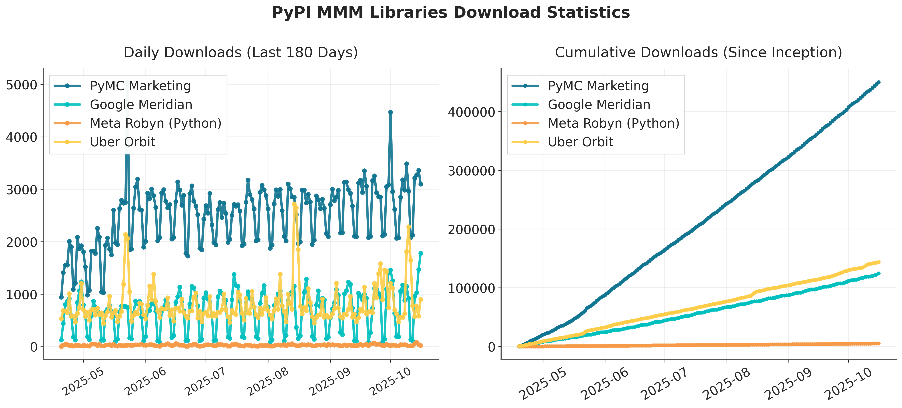

# How We Compare

Given the popularity of the Media Mix Modelling (MMM) approach, numerous packages are available. Below is a concise comparison highlighting how PyMC-Marketing stands against other popular options:

| Feature                       | PyMC-Marketing | Lightweight-MMM* | Robyn          | Orbit KTR | Meridian               |
|-------------------------------|:--------------:|:---------------:|:--------------:|:---------:|:----------------------:|
| **Language**                  | Python         | Python          | R              | Python    | Python                 |
| **Approach**                  | Bayesian       | Bayesian        | Traditional ML | Bayesian  | Bayesian               |
| **Foundation**                | PyMC           | NumPyro/JAX     | -              | STAN/Pyro | TensorFlow Probability |
| **Company**                   | PyMC Labs      | Google          | Meta           | Uber      | Google                 |
| **Open source**               | ✅              | ✅               | ✅              | ✅         | ✅                      |
| **Model Building**            | 🏗️ Build      | 🏗️ Build       | 🏗️ Build      | 🏗️ Build | 🏗️ Build               |
| **Out-of-Sample Forecasting** | ✅              | ✅               | ❌              | ✅         | ❌                      |
| **Budget Optimizer**          | ✅              | ✅               | ✅              | ❌         | ✅                      |
| **Time-Varying Intercept**    | ✅              | ❌               | ❌              | ✅         | ✅                      |
| **Time-Varying Coefficients** | ✅              | ❌               | ❌              | ✅         | ❌                      |
| **Custom Priors**             | ✅              | ✅               | ❌              | ❌         | ✅                      |
| **Lift-Test Calibration**     | ✅              | ❌               | ✅              | ❌         | ✅                      |
| **Geographic Modeling**       | ✅              | ❌               | ❌              | ❌         | ✅                      |
| **Unit-Tested**               | ✅              | ✅               | ❌              | ✅         | ✅                      |
| **ML-Flow Integration**       | ✅              | ❌               | ❌              | ❌         | ❌                      |
| **GPU Sampling Accelleration**| ✅              | ❌               | -               | ❌         | ✅                      |
| **Consulting Support**        | Provided by Authors              | legacy               | Third-party agency               |   Third-party agency        |  Third-party agency                      |
---
  *lightweight-MMM has been deprecated in favor of Meridian*
### Key Takeaway
Four of the five major libraries for MMM models implement different flavors of Bayesian models. While they share a broadly similar statistical foundation, they differ in API flexibility, underlying technology stack, and implementation approach.

PyMC-Marketing stands out as the most widely used library by PyPI downloads (see plot below), offering unmatched flexibility and a comprehensive set of advanced features. This makes it ideal for teams looking for a highly customizable, state-of-the-art solution. However, its breadth and depth also make it the most sophisticated option, which may require a steeper learning curve. Other libraries have their own strengths—for example, Google Meridian features a more opinionated API and seamless integration with the Google ecosystem, which can be advantageous for organizations already embedded in Google’s stack.

Your optimal choice should depend primarily on:

1. Your team's technical expertise  
2. Your primary advertising channels  
3. Preference for an independent open-source solution vs. one sponsored by Ad Networks  

## Our Reccomendation

### Choose Meta Robyn if:

- Your team primarily uses R instead of Python
- You prefer a simpler but less rigorous approach  than Bayesian Models (Ridge regression)
- You want direct integration with Meta/Facebook advertising data

### Choose Google Meridian if:

- You want a simplified (albeit less flexible) API to build models across geographies
- Direct integration with the Google advertising ecosystem is important
- You want strong integration with other Google products such as Collab

### Choose PyMC-Marketing if:

- Maximum flexibility for complex, unique business requirements is necessary
- You need advanced statistical modeling capabilities (e.g., Gaussian Processes)
- Production ready setup and integration into broader data science workflows is important (ML Flow)
- You prefer independence from major ad publishers and networks
- Professional consulting support is desirable

