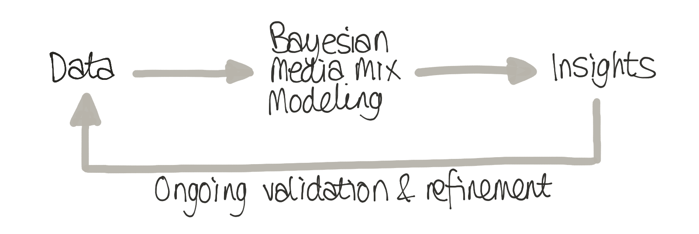
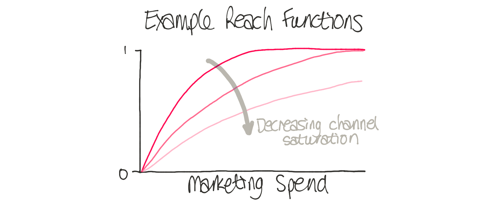
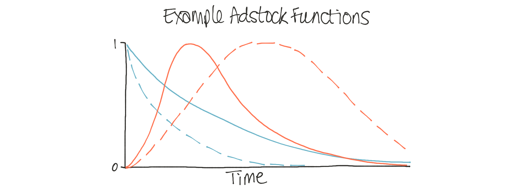
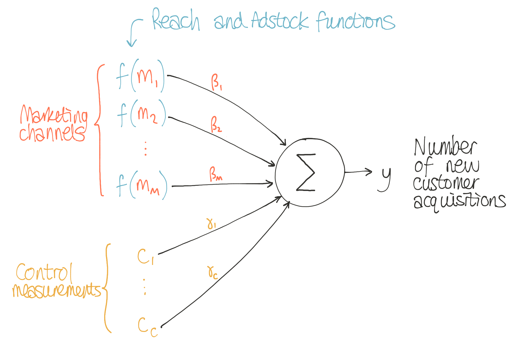

# Introduction to Media Mix Modeling

A problem faced by many companies is how to allocate marketing budgets across different media channels. For example, how should funds be allocated across TV, radio, social media, direct mail, or daily deals?

One approach might be to use heuristics, i.e. sensible rules of thumb, about what might be most appropriate for your company. For instance, a widely used approach is to simply set your marketing budget as a percentage of expected revenues. But this involves guesswork - something we want to avoid regardless of the size of the marketing budget involved.

Fortunately, with Bayesian modeling, we can do better than this! So-called Media Mix Modeling (MMM) can estimate how effective each advertising channel is in driving our outcome measure of interest, whether that is sales, new customer acquisitions, or any other key performance indicator (KPI). Once we have estimated each channel's effectiveness we can optimize our budget allocation to maximize our KPI.

## What can you do with Media Mix Modeling?

Media Mix Modeling gives rich insights and is used in many ways, but here are some of the highlights:

1. Understand the effectiveness of different media channels in driving customer acquisition. Not only can you learn from data about the most influential media channels for your business, but you can update this understanding over time. By incorporating new marketing and customer acquisition data on an ongoing basis, you can learn about the changing effectiveness of each channel over time.
2. Avoid being misled by other factors. If the rate of customer acquisitions dramatically changes, was this caused by changes in marketing spend across media channels? Or was it caused by other factors such as changes in seasonality, consumer sentiment, economic factors, pricing changes, etc.?
3. Inform media spending decisions. Having gained an understanding of the effectiveness of different media channels, such as knowing the customer acquisition cost per channel or the degree of channel saturation, this could be used to inform future marketing spend across channels.
4. Optimize future marketing decisions. Rather than just inform future budget spending decisions, it is actually possible to optimize these spending decisions. For example, it is possible to calculate budgets across media channels that maximize our KPI for a given total budget. See this blog post on Bayesian decision-making for more information.
5. Inspire marketing experiments. If there is uncertainty about the effectiveness or saturation of channels, we can intelligently respond to this by running lift or incrementality tests to resolve some of this uncertainty.
6. Validate your understanding through predictions. We gain confidence in our knowledge of the world by making predictions and comparing them to what happens. MMM also generates forecasts that we can check against reality. As a result, we can improve our understanding and modeling iteratively to become more accurate over time.

## How does Media Mix Modeling work?

In simple terms, we can understand MMMs as regression modeling applied to business data. The goal is to estimate the impact of marketing activities and other drivers on a metric of interest, such as the number of new customers per week.

To do this, we use two main types of predictor variables:

1. The level of spend for each media channel over time.
2. A set of control measurements that could capture seasonality or economic indicators.
The basic approach to MMMs uses linear regression to estimate a set of coefficients for the relative importance of each of these predictors, but real-world MMMs commonly incorporate also non-linear factors to more accurately capture the effect of marketing activities on consumer behaviour:

### The reach (or saturation) function

Rather than model our KPI as a linear function of marketing spend, the reach function models the potential saturation of different channels: While the initial money spent on an advertising channel might have a big impact on customer acquisition, further investment will often lead to diminishing returns as people get used to the message. When we think about optimization, modeling this effect is critical. Some channels may be nowhere close to being saturated and yield significant increases in customer acquisitions for spending for that channel. Knowing the saturation of each channel is vital in making future marketing spend decisions.

### The adstock function

The marketing spend for a given channel may have a short-term effect or long-term impact. Remember that jingle from a TV ad you've seen 20 years ago? That's a great long-term impact. The adstock function captures these time-course effects of different advertising channels. Knowing this is crucial - if we know some channels have short-term effects that quickly decay over time, we could plan to do more frequent marketing. But suppose another channel has a long, drawn-out impact on driving customer acquisitions. In that case, it may be more effective to use that channel more infrequently.

Thus we can summarize the full MMM with this image:

## Putting it all together

To see how all these different components come together, you can review the {ref}`MMM Example notebook <mmm_example>`.
