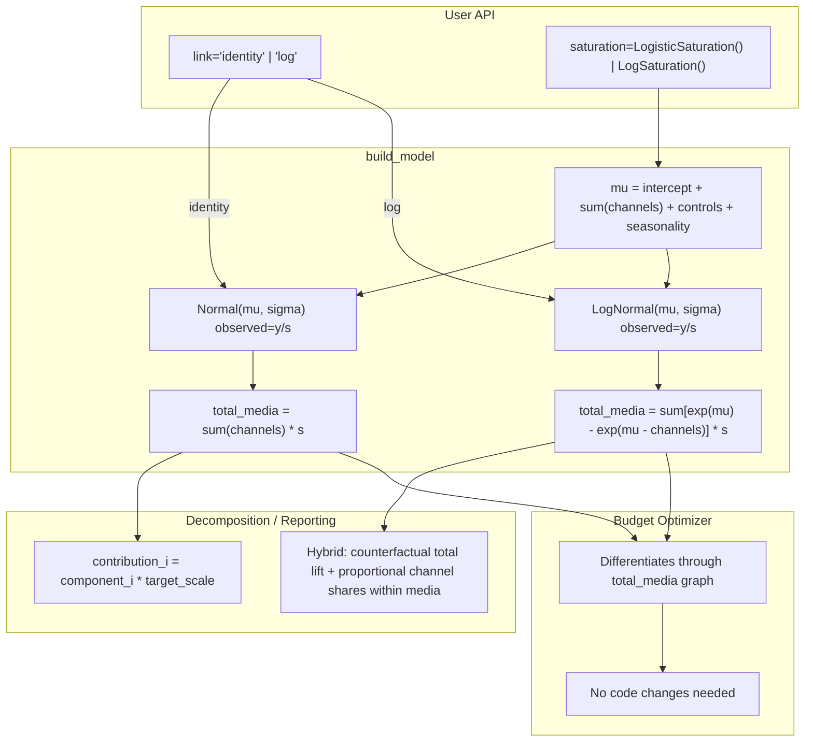
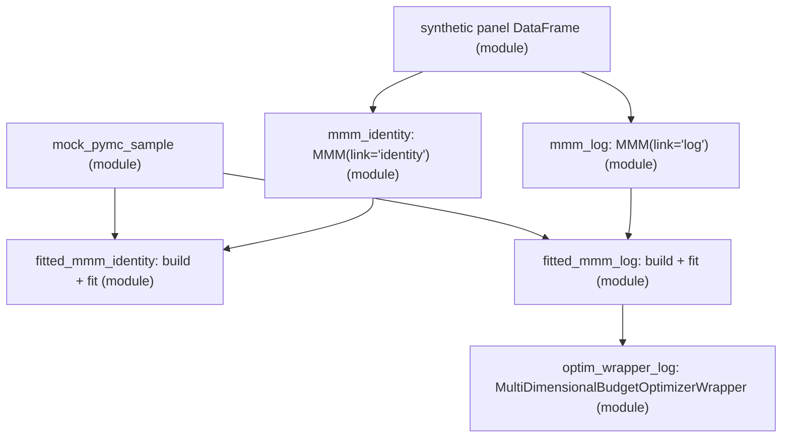

# Multiplicative Models for PyMC-Marketing MMM

Design proposal for extending the MMM class in PyMC-Marketing to support multiplicative models (log and log-log), covering the link function, decomposition in original scale, and budget optimization.

## Status Quo: Additive Model

The current multidimensional `MMM` ([multidimensional.py](pymc_marketing/mmm/multidimensional.py)) builds an **additive linear predictor** in scaled-target space:

```
mu = intercept + sum(channel_contributions) + sum(control_contributions) + seasonality + mu_effects
y_scaled ~ Normal(mu, sigma)
```

where `y_scaled = y / target_scale` and channel data is similarly scaled. This means `E[y] = mu * target_scale` -- a purely **identity-link** model where each component's contribution to `y` is separable by simple addition.

**Three places encode this assumption:**

1. **`build_model`** (line ~2134): constructs `mu` additively, defines `total_media_contribution_original_scale` as `channel_contribution.sum("date") * target_scale`
2. **Decomposition** (`compute_mean_contributions_over_time`, `MMMIDataWrapper.get_contributions`): multiplies each posterior component by `target_scale` to get additive y-scale contributions
3. **Optimization** (`MultiDimensionalBudgetOptimizerWrapper`): optimizes `total_media_contribution_original_scale`, which is linear in the channel contributions

---

## The Two Target Model Types

### Model (1): Log Model (multiplicative in y)

```
log(y) = intercept + sum(saturation(adstock(x))) + controls + seasonality + noise
```

equivalently: `y = exp(intercept) * prod(exp(channel_i)) * exp(controls) * exp(noise)`

- The **linear predictor mu is still additive** -- exactly the same code builds it
- The **likelihood changes** to `LogNormal` (or equivalently, target is log-transformed and a Normal likelihood is used)
- Coefficients in mu-space become **multiplicative factors** on y

### Model (2): Log-Log Model

```
log(y) = intercept + sum(beta_i * log(adstock(x_i))) + controls + seasonality + noise
```

- Same as Model (1) but the **saturation function is replaced by `log`** (or `log1p` for numerical stability)
- Coefficients beta_i are **elasticities**: `beta_i = (dy/y) / (dx_i/x_i)`
- The adstock is applied to raw spend first, then log-transformed

---

## Can LogNormal Likelihood Work Today?

**Mechanically, yes.** A user can already pass:

```python
model_config = {
    "likelihood": Prior(
        "LogNormal",
        sigma=Prior("HalfNormal", sigma=0.5, dims=dims),
        dims=("date", *dims),
    ),
}
```

Since `Prior.create_likelihood_variable(name, mu=mu, observed=target_data_scaled)` just creates `pm.LogNormal(name, mu=mu, sigma=sigma, observed=target_data_scaled)`, and PyMC's `LogNormal(mu, sigma)` means `log(X) ~ Normal(mu, sigma)`, the model would be `y_scaled ~ LogNormal(mu, sigma)`, i.e., `log(y_scaled) ~ Normal(mu, sigma)`.

**But the downstream pipeline breaks:**

| Component | What Breaks | Why |
|---|---|---|
| `total_media_contribution_original_scale` | Wrong quantity | Computes `sum(channel_contrib) * target_scale` -- this is log-space sum times scale, not actual y-scale media effect |
| `compute_mean_contributions_over_time` | Wrong decomposition | Multiplies log-space components by `target_scale`, assumes additive partition of y |
| `MMMIDataWrapper.get_contributions` | Same issue | `channel_contribution * target_scale` is meaningless for a log model |
| Waterfall / share plots | Incorrect shares | Assumes components sum to y; in log model they sum to log(y) |
| `optimize_budget` default response | Wrong objective | Optimizes sum of log-space contributions, not total predicted y |

---

## Proposed Design

### A. New `link` Parameter on MMM

Add a `link` parameter to `MMM.__init__` (in [multidimensional.py](pymc_marketing/mmm/multidimensional.py)):

```python
from enum import Enum

class LinkFunction(str, Enum):
    IDENTITY = "identity"
    LOG = "log"

class MMM(RegressionModelBuilder):
    def __init__(self, ..., link: str | LinkFunction = LinkFunction.IDENTITY):
        self.link = LinkFunction(link)
```

- `"identity"` (default): current behavior unchanged
- `"log"`: multiplicative model via LogNormal likelihood

### B. Changes in `build_model` (line ~2032)

The **linear predictor construction is unchanged** -- `mu` is still built additively in both cases. The differences are:

**1. Default likelihood for log link:**

When `link="log"`, the default `model_config["likelihood"]` should be `LogNormal`:

```python
@property
def default_model_config(self):
    if self.link == LinkFunction.LOG:
        likelihood = Prior(
            "LogNormal",
            sigma=Prior("HalfNormal", sigma=0.5, dims=self.dims),
            dims=("date", *self.dims),
        )
    else:
        likelihood = Prior(
            "Normal",
            sigma=Prior("HalfNormal", sigma=2, dims=self.dims),
            dims=("date", *self.dims),
        )
    ...
```

**2. Redefine `total_media_contribution_original_scale` for log link:**

Currently (identity link, line ~2128):

```python
pmd.Deterministic(
    "total_media_contribution_original_scale",
    (channel_contribution.sum(dim="date") * _target_scale).sum(),
)
```

For log link, the media contribution to y in original scale is the difference between y-with-media and y-without-media:

```python
if self.link == LinkFunction.LOG:
    mu_media = channel_contribution.sum(dim="channel")
    y_hat = ptx.math.exp(mu_var) * _target_scale
    y_hat_no_media = ptx.math.exp(mu_var - mu_media) * _target_scale
    pmd.Deterministic(
        "total_media_contribution_original_scale",
        (y_hat - y_hat_no_media).sum(dim="date").sum(),
    )
else:
    # current code
    pmd.Deterministic(
        "total_media_contribution_original_scale",
        (channel_contribution.sum(dim="date") * _target_scale).sum(),
    )
```

This defines media contribution as: `sum_t [exp(mu_t) - exp(mu_t - media_t)] * target_scale`.

**3. Add `y_hat` deterministic for log link:**

```python
if self.link == LinkFunction.LOG:
    pmd.Deterministic(
        "y_hat_original_scale",
        (ptx.math.exp(mu_var) * _target_scale).transpose("date", ...),
    )
```

**4. Scaling considerations:**

The current scaling `target_data_scaled = target / target_scale` works for LogNormal: we observe `y/s ~ LogNormal(mu, sigma)`, meaning `log(y/s) ~ Normal(mu, sigma)`, or `log(y) ~ Normal(mu + log(s), sigma)`. The intercept naturally absorbs `log(s)`. No changes needed to the scaling pipeline.

### C. New Saturation: `LogSaturation` for Log-Log Models

Add to [saturation.py](pymc_marketing/mmm/components/saturation.py):

```python
class LogSaturation(SaturationTransformation):
    """Log transform for log-log models.

    Applies beta * log(1 + x), mapping spend through a logarithmic
    curve. When combined with link="log", coefficients beta become
    elasticities.
    """
    lookup_name = "log_saturation"

    def function(self, x, beta, *, dim=None):
        return beta * ptx.math.log1p(x)

    default_priors = {
        "beta": Prior("HalfNormal", sigma=1),
    }
```

Usage for a log-log model:

```python
mmm = MMM(
    ...,
    link="log",
    saturation=LogSaturation(),
    adstock=GeometricAdstock(l_max=4),
)
```

The `forward_pass` applies `saturation(adstock(x))` = `beta * log(1 + adstock(x))`, and with the log link this gives `log(y) ~ beta * log(1 + adstock(x))` per channel -- the log-log specification.

### D. Decomposition for Multiplicative Models

This is the most conceptually involved change. In a log model, components are additive in **log-space** but multiplicative in **y-space**.

**The core problem:** channel-level counterfactual effects (`exp(mu) - exp(mu - channel_i)`) are the most interpretable per-channel metric, but they **do not sum** to the total media effect because marginal removals overlap. Waterfall plots and share-of-contribution tables require a partition that sums to the whole.

**Resolved approach: Hybrid strategy (two layers)**

Layer 1 -- **Total media lift** via counterfactual (used by optimizer and top-level reporting):

```
total_media_lift = exp(mu) - exp(mu - media_total)
```

This is already defined as `total_media_contribution_original_scale` in Section B. Clean, interpretable, differentiable.

Layer 2 -- **Per-channel allocation within media** via log-space proportional shares (used by waterfalls and channel-share plots):

```
media_total_log = sum_c(channel_c)                              # log-space
share_c         = channel_c / media_total_log                   # fraction in log-space
contribution_c  = total_media_lift * share_c                    # y-scale, sums to total_media_lift
```

This is stable because `media_total_log` is the sum of only the media components (all non-negative after saturation), avoiding the instability of dividing by the full `mu` which includes intercept and potentially negative controls/seasonality.

For **non-media components** (intercept, controls, seasonality), report the residual:

```
non_media_contribution = y_hat - total_media_lift
```

This can optionally be further split by proportional shares within non-media components.

**Implementation in `compute_mean_contributions_over_time`** ([multidimensional.py](pymc_marketing/mmm/multidimensional.py), line ~1250):

```python
def compute_mean_contributions_over_time(self) -> pd.DataFrame:
    if self.link == LinkFunction.LOG:
        return self._compute_multiplicative_contributions()
    else:
        return self._compute_additive_contributions()  # current code

def _compute_multiplicative_contributions(self) -> pd.DataFrame:
    posterior = self.idata.posterior
    target_scale = self.idata.constant_data["target_scale"]

    mu_total = posterior["mu"]  # full linear predictor
    channel_contrib = posterior["channel_contribution"]  # (chain, draw, date, *dims, channel)
    media_total_log = channel_contrib.sum(dim="channel")

    y_hat = (np.exp(mu_total) * target_scale).mean(("chain", "draw"))
    y_hat_no_media = (np.exp(mu_total - media_total_log) * target_scale).mean(("chain", "draw"))
    total_media_lift = y_hat - y_hat_no_media

    result = {}
    for ch in channel_contrib.coords["channel"].values:
        ch_log = channel_contrib.sel(channel=ch)
        share = (ch_log / media_total_log).mean(("chain", "draw"))
        result[str(ch)] = total_media_lift * share

    result["non_media"] = y_hat_no_media
    return xr.Dataset(result).to_dataframe().reset_index()
```

**For `MMMIDataWrapper` and plot functions:**

Store `link` in model metadata (e.g., `constant_data` or a model attribute persisted alongside idata). When `link="log"`, decomposition methods use the hybrid strategy above. When link metadata is absent (legacy models), default to identity-link behavior.

### E. Budget Optimization

**The optimizer itself needs no changes.** The `BudgetOptimizer` in [budget_optimizer.py](pymc_marketing/mmm/budget_optimizer.py) is already model-form agnostic:

1. It replaces `channel_data` with the budget decision variable via `pm.do`
2. It extracts `response_variable` from the graph and differentiates through it
3. It compiles and minimizes `-utility(response_distribution)`

The graph for `total_media_contribution_original_scale` changes (Section B above) to `sum[exp(mu) - exp(mu_no_media)] * target_scale`, but that's defined inside `build_model`, not in the optimizer. The optimizer just differentiates through whatever graph is attached to that variable name.

**The key insight**: For the log link, `d(total_media_contribution)/d(budget) = sum_t exp(mu_t) * d(mu_t)/d(budget) * target_scale`. PyTensor computes this gradient automatically.

**One change in `MultiDimensionalBudgetOptimizerWrapper`**: The default `response_variable` can stay as `"total_media_contribution_original_scale"` since we redefine that deterministic for the log link. No optimizer code changes needed.

### F. Summary of Changes by File

**[pymc_marketing/mmm/multidimensional.py](pymc_marketing/mmm/multidimensional.py)**

- Add `LinkFunction` enum and `link` parameter to `MMM.__init__`
- Add `LinkSpec` strategy abstraction (identity / log) centralizing inverse link, default likelihood, target validation, and media-total graph construction
- Modify `default_model_config` to delegate to `LinkSpec` for likelihood and intercept priors
- Modify `build_model` to define `total_media_contribution_original_scale` and `y_hat_original_scale` via `LinkSpec`
- Add `_compute_multiplicative_contributions` helper (hybrid: counterfactual lift + proportional shares)
- Modify `compute_mean_contributions_over_time` to dispatch based on link
- Make `add_original_scale_contribution_variable` link-aware (disable or adapt for log link)
- Store `link` in model metadata / idata for downstream use
- Add fit-time validation: `y > 0` when `link="log"`
- Add user warning when `mu_effects` are present under `link="log"` (semantics change)
- Add link-likelihood compatibility validation

**[pymc_marketing/mmm/components/saturation.py](pymc_marketing/mmm/components/saturation.py)**

- Add `LogSaturation` class

**[pymc_marketing/data/idata/mmm_wrapper.py](pymc_marketing/data/idata/mmm_wrapper.py)**

- Modify `get_contributions` and `get_channel_contributions` to dispatch between additive and log-link hybrid decomposition based on link metadata
- Default to identity behavior when link metadata is absent (backward compat)

**[pymc_marketing/mmm/budget_optimizer.py](pymc_marketing/mmm/budget_optimizer.py)**

- No code changes needed (optimizer is model-form agnostic; response variable graph changes are in `build_model`)
- Add tests confirming response-variable differentiability and monotonicity under log link

**[pymc_marketing/mmm/plot.py](pymc_marketing/mmm/plot.py)**

- Waterfall and contribution plots dispatch to hybrid decomposition for log link; stacked bars still sum to predicted y

---

## Design Diagram



---

## Key Design Decisions and Tradeoffs

**1. Why a `link` parameter instead of just letting users set LogNormal?**

Users can already set LogNormal as the likelihood, but the decomposition, reporting, and optimization pipelines silently produce wrong results. A first-class `link` parameter makes the downstream pipeline aware of the model form and adjusts accordingly.

**2. Why hybrid decomposition (counterfactual lift + proportional channel shares)?**

Pure counterfactual per-channel effects (`exp(mu) - exp(mu - channel_i)`) are interpretable but overlap and don't sum to the total. Pure proportional allocation over all components (`y_hat * comp_i / sum(all)`) is fragile when negative components exist. The hybrid combines strengths: counterfactual for the total media lift (robust, differentiable, causal), and proportional shares within the media-only log-space (stable denominator, always sums to total). Shapley values are the gold-standard for exact fairness but require `2^n` evaluations; reserved as a future advanced mode.

**3. Why `log1p(x)` in `LogSaturation` instead of `log(x)`?**

`log(0)` is undefined. Since channel spend can be zero (no investment), `log1p(x) = log(1+x)` is well-defined everywhere and behaves like `log(x)` for large x. This is the standard choice for log-log marketing models.

**4. Why not a separate `MultiplicativeMMM` class?**

The linear predictor `mu` is built identically in both cases. The only differences are: (a) the likelihood distribution, (b) how contributions are converted to y-scale, (c) how decomposition works. These are small conditional branches, not a different model architecture. A separate class would duplicate the vast majority of code.

**5. Target scaling with LogNormal:**

`y/s ~ LogNormal(mu, sigma)` means `log(y/s) ~ Normal(mu, sigma)`, i.e., `log(y) - log(s) ~ Normal(mu, sigma)`. The intercept absorbs `log(s)`. This is algebraically clean and requires no changes to the scaling pipeline. The intercept's interpretation changes (it includes the log of the scale factor), but this is standard practice.

**6. Default intercept prior needs adjustment for log link:**

With identity link, the intercept prior `Normal(mu=0, sigma=2)` works because target is scaled to [0, 1]. With log link, the intercept must absorb `log(target_scale)`. If `target_scale = max(y) = 5000`, the intercept needs to be near `log(5000) ~ 8.5`. The default `Normal(0, 2)` would make sampling inefficient. The `LinkSpec` for log should provide a wider or shifted default intercept prior, or at minimum document this clearly.

**7. `mu_effects` change semantics under log link:**

Custom `MuEffect` components are added to mu additively. Under identity link they contribute additively to y. Under log link they become multiplicative factors on y (`exp(effect)`). Existing user effects designed for identity link silently change interpretation. The plan adds a user-facing warning at fit time when `mu_effects` are present under log link.

**8. `add_original_scale_contribution_variable` is broken for log link:**

This method (line ~1884 in multidimensional.py) multiplies model variables by `target_scale`. Under log link, `channel_contribution` is in log-space, so `channel_contribution * target_scale` is meaningless. The method must be made link-aware (apply `exp` first for log link) or disabled with a clear error.

---

## Independent Engineering Review: Flaws and Improvements

### Main strengths in this plan

- Correctly identifies that changing likelihood alone is insufficient.
- Correctly scopes work across model build, decomposition, wrapper/plots, and optimization.
- Correctly recognizes that optimizer internals are graph-based and mostly model-form agnostic.

### Critical improvements to make this sustainable

#### 1) Decomposition approach: resolved via hybrid strategy

The original proportional rule (`y_hat * component_i / sum(all_components)`) was unstable when denominator nears zero, behaved poorly with negative components, and was not counterfactual. Pure per-channel counterfactual effects don't sum to the total media lift.

**Resolution (reflected in Section D above):** use a two-layer hybrid:

- Layer 1: counterfactual total media lift (`exp(mu) - exp(mu - media_total)`)
- Layer 2: proportional log-space shares **within media only** to allocate lift across channels

This is stable (media components are non-negative after saturation), sums to total, and is counterfactual at the aggregate level. Shapley-style exact allocation is reserved as a future advanced mode.

#### 2) Add link-likelihood compatibility guardrails

The plan should explicitly validate combinations:

- `link="identity"` -> default `Normal`
- `link="log"` -> default `LogNormal`

If user overrides with an incompatible likelihood, raise a clear `ValueError` to avoid silent semantic mismatch in decomposition and optimization.

#### 3) Add strict positivity checks for log link

`LogNormal` requires strictly positive observations. The plan should add fit-time validation `y > 0` when `link="log"` and fail fast with clear guidance.

#### 4) Tighten log-log interpretability claims

Under current scaling, parameters are not always strict textbook elasticities. Reword docs to "elasticity-like under current scaling"; reserve strict elasticity interpretation for a future explicit transform/scaling mode.

#### 5) Reduce branching with a dedicated link abstraction

To keep maintainability high, avoid scattering `if self.link == ...` throughout multiple methods/files.

**Improve:** add a small link strategy abstraction (`LinkSpec`) that centralizes:

- `inverse_link(mu)`
- default likelihood prior
- target validation
- `total_media_contribution_original_scale` logic

This keeps future extension (e.g., other links) low-risk.

#### 6) Add backward compatibility and serialization checks

Adding `link` changes model configuration semantics. Plan should include:

- serialization of `link`
- load-time default to identity for older models
- wrapper behavior for legacy idata without link metadata

#### 7) Clarify optimizer contract for response variable

Even if optimizer code is unchanged, the meaning of `total_media_contribution_original_scale` must be explicitly defined per link and tested for correctness/differentiability.

---

## Implementation Order

1. API contract: `link` enum + compatibility matrix + positivity checks + `mu_effects` warning
2. `LinkSpec` abstraction (identity/log) centralizing inverse link, default likelihood, default intercept prior, target validation, and media-total graph
3. Add `LogSaturation` component
4. Integrate `LinkSpec` into `build_model`: log-link deterministics (`y_hat_original_scale`, total media incremental counterfactual)
5. Make `add_original_scale_contribution_variable` link-aware
6. Implement hybrid decomposition in `compute_mean_contributions_over_time`
7. Update `MMMIDataWrapper` decomposition dispatch
8. Update waterfall/contribution plots for log-link hybrid
9. Add phased tests: validation, deterministic math, decomposition consistency, optimizer monotonicity, identity no-regression
10. Add serialization round-trip and backward-compat tests

---

## Testing Strategy

### Python environment

All tests and commands must be run inside the `pymc-marketing-dev` micromamba environment:

```bash
micromamba activate pymc-marketing-dev
```

Use the absolute path to the Python executable from this environment when invoking pytest, pre-commit, or any other tool (discover with `which python` after activation).

### Existing test infrastructure

The MMM test suite uses a consistent set of patterns that the new tests should follow:

- **Mocked sampling**: all tests that call `MMM.fit(...)` depend on the module-level `mock_pymc_sample` fixture (from `pymc.testing`), which replaces MCMC with a fast deterministic harness. New tests must do the same -- no real `pm.sample` in CI.
- **Synthetic data fixtures**: `test_multidimensional.py` uses small synthetic panel DataFrames (7-14 dates, 2-3 geos, 2-3 channels). Optimizer tests in `test_budget_optimizer_multidimensional.py` use `fitted_mmm` module-scoped fixtures that build + fit + PPC under mock sampling.
- **Parametrize grids**: `test_fit` in `test_multidimensional.py` already parametrizes over data dimensions and time-varying configurations. `test_saturation.py` parametrizes over all registered saturations via `SATURATION_TRANSFORMATIONS.items()`.
- **Dummy idata**: `test_budget_optimizer.py` builds synthetic `InferenceData` via `az.from_dict(posterior={...})` for fast optimizer-only tests without model fitting.

### Test files and what they cover

| File | Purpose | New link tests land here? |
|---|---|---|
| `tests/mmm/components/test_saturation.py` | Saturation component unit tests (apply, priors, curves, serialization) | Yes -- `LogSaturation` registration, apply, sample_curve, round-trip serialization |
| `tests/mmm/test_multidimensional.py` | MMM integration tests (build, fit, predict, decomposition, scaling) | Yes -- link validation, build_model under log link, decomposition consistency, `add_original_scale` guard |
| `tests/mmm/test_budget_optimizer_multidimensional.py` | Optimizer integration (allocate_budget, masks, callbacks, merged models) | Yes -- optimizer behavior under log-link model |

### Test layers (ordered by risk and dependency)

#### Layer 1: API validation (unit tests, no fitting)

These tests exercise the `link` parameter, `LinkSpec` creation, and input guardrails without building or fitting any model. They are fast and should run first.

**Where:** `test_multidimensional.py` (new test class or alongside existing `TestPydanticValidation`)

- `test_link_default_is_identity` -- `MMM(...)` without `link` argument defaults to identity
- `test_link_accepts_string_and_enum` -- `MMM(..., link="log")` and `MMM(..., link=LinkFunction.LOG)` both work
- `test_link_invalid_value_raises` -- `MMM(..., link="sqrt")` raises `ValueError`
- `test_log_link_default_likelihood_is_lognormal` -- `mmm.default_model_config["likelihood"]` is `LogNormal` when `link="log"`
- `test_identity_link_default_likelihood_is_normal` -- unchanged behavior
- `test_link_likelihood_incompatible_raises` -- `link="identity"` + `LogNormal` likelihood override raises `ValueError` with guidance message
- `test_log_link_negative_target_raises` -- `mmm.fit(X, y_with_negatives)` raises `ValueError` before sampling
- `test_log_link_zero_target_raises` -- same for y containing zeros
- `test_log_link_mu_effects_warning` -- `MMM(..., link="log", mu_effects=[...])` emits a `UserWarning` about semantics change

#### Layer 2: `LogSaturation` component (unit tests, no fitting)

**Where:** `test_saturation.py`

These are automatically covered if `LogSaturation` is registered in `SATURATION_TRANSFORMATIONS`, since the existing parametrized tests (`test_apply`, `test_prefix`, `test_from_dict_without_priors`, etc.) iterate over all registered saturations. Add targeted tests for:

- `test_log_saturation_at_zero` -- `log1p(0) = 0`, so output is zero at zero spend
- `test_log_saturation_monotonic` -- output is strictly increasing for positive input
- `test_log_saturation_sample_curve` -- curve shape is concave (diminishing returns)
- `test_log_saturation_serialization_round_trip` -- `to_dict` / `from_dict` preserves parameters

#### Layer 3: build_model deterministics (integration, build only -- no fit)

These tests call `mmm.build_model(X, y)` under each link and inspect the PyMC model graph for correct variable names and shapes. No sampling needed.

**Where:** `test_multidimensional.py`

- `test_build_model_identity_has_expected_deterministics` -- `total_media_contribution_original_scale`, `channel_contribution`, `mu` all present (regression: unchanged)
- `test_build_model_log_has_expected_deterministics` -- same variables present, plus `y_hat_original_scale`
- `test_build_model_log_total_media_is_counterfactual` -- inspect the graph: `total_media_contribution_original_scale` depends on `exp(mu) - exp(mu - media)`, not on `channel_contribution * target_scale`
- `test_build_model_log_add_original_scale_raises_or_adapts` -- calling `add_original_scale_contribution_variable` under log link either adapts correctly or raises `ValueError`

**Parametrize axis:** `@pytest.mark.parametrize("link", ["identity", "log"])` on tests that should pass for both links (e.g., model builds successfully, variable names present).

#### Layer 4: Decomposition consistency (integration, requires fit)

These tests fit a model (under `mock_pymc_sample`) and then verify that the decomposition output is self-consistent.

**Where:** `test_multidimensional.py` (extend existing `TestComputeMeanContributionsOverTime` class)

- `test_identity_decomposition_sums_to_mu` -- for identity link, sum of all contribution columns approximates `mu * target_scale` (existing behavior, regression test)
- `test_log_decomposition_channels_sum_to_media_lift` -- for log link, sum of per-channel contributions equals `total_media_lift` (= `y_hat - non_media`)
- `test_log_decomposition_all_parts_sum_to_y_hat` -- `sum(channel contributions) + non_media = y_hat`
- `test_log_decomposition_channel_shares_non_negative` -- all channel shares are >= 0 (guaranteed by saturation non-negativity)
- `test_log_decomposition_non_media_positive` -- `non_media > 0` (baseline sales exist)

**Fixture:** module-scoped `fitted_mmm_log` that builds + fits with `link="log"`, reusing the same synthetic data pattern as `fitted_mmm` but with strictly positive target.

#### Layer 5: Budget optimizer under log link (integration)

These tests verify that optimization works correctly when the model graph uses the log-link counterfactual `total_media_contribution_original_scale`.

**Where:** `test_budget_optimizer_multidimensional.py`

- `test_optimize_budget_log_link_runs` -- basic smoke test: `optimize_budget` completes without error under log-link model
- `test_optimize_budget_log_link_monotonic` -- with more budget, total media contribution is higher (sanity check on gradient direction)
- `test_optimize_budget_log_link_gradient_finite` -- no NaN/Inf in optimizer result (differentiability of `exp(mu)` path)
- `test_optimize_budget_identity_unchanged` -- regression: identity-link optimizer results are identical to current behavior

**Fixture:** module-scoped `fitted_mmm_log_for_optim` that builds + fits a log-link model under `mock_pymc_sample`, then wraps it in `MultiDimensionalBudgetOptimizerWrapper`.

#### Layer 6: Serialization and backward compatibility

**Where:** `test_multidimensional.py`

- `test_save_load_round_trip_identity` -- save + load identity-link model, verify `link` attribute preserved
- `test_save_load_round_trip_log` -- same for log link
- `test_load_legacy_model_defaults_to_identity` -- load a model saved without `link` attribute; verify it defaults to `identity` and all downstream behavior is unchanged
- `test_idata_wrapper_no_link_metadata_defaults_identity` -- `MMMIDataWrapper` on old idata without link metadata uses additive decomposition

### Parametrize strategy for link coverage

Rather than duplicating every existing test for each link, use a targeted approach:

- **Most existing tests run only under identity link** (no change, regression coverage).
- **A focused subset is parametrized over `["identity", "log"]`**: `test_fit`, `test_build_model_*`, `test_sample_posterior_predictive`, scaling tests. This is the `@pytest.mark.parametrize("link", ["identity", "log"])` axis.
- **Log-link-specific tests** (decomposition consistency, optimizer monotonicity, positivity validation) run only under `link="log"`.

This keeps CI runtime bounded while covering the critical integration paths.

### Fixture dependency graph



All fitting fixtures are **module-scoped** to avoid repeated sampling overhead. The synthetic data fixture generates strictly positive target values (required for log link).

---

## Why This Design Solves the Problem

The original problem has three parts: (a) enable log and log-log model specifications, (b) make decomposition and reporting correct under those specifications, and (c) keep budget optimization valid. Below is a precise account of why each part is solved and why the solution is minimal, correct, and composable.

### The additive linear predictor is the right foundation for all three model types

The key mathematical insight behind this design is that log and log-log models do not require a different linear predictor -- they require a different **link** between the predictor and the observed target. In all three cases:

```
mu = intercept + sum(saturation(adstock(x))) + controls + seasonality
```

- Identity link: `E[y] = mu` (additive model)
- Log link + standard saturation: `E[y] ~ exp(mu)` (log model, multiplicative in y)
- Log link + log saturation: `E[y] ~ exp(mu)` with `mu` containing `beta * log1p(adstock(x))` (log-log model)

Because `mu` is built identically in all cases, the entire model-building pipeline -- adstock, saturation, controls, seasonality, `mu_effects`, time-varying parameters -- works without modification. The `forward_pass`, the `model_config` machinery, hierarchical priors, panel dimensions, and the `MuEffect` protocol all operate on `mu` and are link-agnostic by construction. This is why a single `link` parameter, rather than a parallel model class, is the correct abstraction.

### LogNormal likelihood is the natural and minimal way to express the log link

Rather than transforming the target (`log(y)`) and using a Normal likelihood -- which would require changing the scaling pipeline, adjusting all original-scale reporting, and breaking the existing `target_data_scaled = target / target_scale` contract -- the design uses `LogNormal(mu, sigma)` on the already-scaled target. Since PyMC's `LogNormal(mu, sigma)` means `log(X) ~ Normal(mu, sigma)`, we get `log(y/s) ~ Normal(mu, sigma)` for free. The intercept absorbs `log(s)` and the scaling pipeline is unchanged. This avoids a class of bugs where log-transformed targets interact unexpectedly with scaling, posterior predictive sampling, or downstream wrappers.

### `LogSaturation` composes naturally for log-log models

The log-log specification requires `log(spend)` in the linear predictor. Rather than adding a separate input transformation step (which would require changes to `forward_pass`, the optimizer's `channel_data` substitution, and the scaling pipeline), this design expresses the log transform as a `SaturationTransformation`. Since `forward_pass` already applies `saturation(adstock(x))`, using `LogSaturation` gives `beta * log1p(adstock(x))` -- exactly the log-log term. This composes with all existing adstock types, inherits lift-test integration, and requires zero changes to the forward pass or optimizer graph substitution.

### The hybrid decomposition solves the "sums to total" problem unique to multiplicative models

In an additive model, each component of `mu` maps linearly to a component of `y`, so contributions are trivially separable. In a multiplicative model this fails: `exp(a + b) != exp(a) + exp(b)`. The design solves this with a two-layer strategy:

1. **Total media lift** is defined counterfactually: `exp(mu) - exp(mu - media)`. This is the exact incremental effect of all media on `y` -- robust, differentiable, and causal in interpretation.
2. **Per-channel shares within media** use proportional allocation in log-space: `share_c = channel_c / sum(all channels)`. Because saturation outputs are non-negative, the denominator is always positive and the shares always sum to 1.

The product `total_media_lift * share_c` gives each channel a y-scale contribution that sums exactly to the total media lift. Non-media components receive the residual `y_hat - total_media_lift`. This ensures waterfall plots, share tables, and contribution time series are all mathematically consistent under the log link.

### Budget optimization requires no code changes because it is already graph-based

The `BudgetOptimizer` replaces `channel_data` in the PyMC graph via `pm.do` and differentiates through whatever deterministic is named by `response_variable`. It never assumes a functional form for the relationship between spend and response -- it only requires that the graph is differentiable. Since `total_media_contribution_original_scale` is redefined inside `build_model` for the log link as `sum[exp(mu) - exp(mu - media)] * target_scale`, the optimizer automatically computes `d(total_media)/d(budget) = sum_t exp(mu_t) * d(mu_t)/d(budget) * target_scale` via PyTensor's autodiff. No optimizer code changes, constraint changes, or interface changes are needed. The same `optimize_budget` call works for identity, log, and log-log models.

### The `LinkSpec` abstraction prevents maintainability decay

Without a centralized abstraction, link-specific logic would scatter across `build_model`, `default_model_config`, `compute_mean_contributions_over_time`, `add_original_scale_contribution_variable`, `MMMIDataWrapper`, and plotting code. Each new link function would require touching all of these independently. The `LinkSpec` strategy object (`IdentityLinkSpec`, `LogLinkSpec`) centralizes the five link-dependent decisions:

- `inverse_link(mu)` -- how to map linear predictor to y-scale
- default likelihood prior
- default intercept prior
- target validation rules
- `total_media_contribution_original_scale` graph construction

Adding a future link (e.g., `sqrt`, `logit` for bounded outcomes) means implementing a single new `LinkSpec` subclass rather than auditing every conditional branch in the codebase.

### Summary: what each component of the solution contributes

- **`link` parameter**: routes the entire pipeline -- build, decompose, report, optimize -- through the correct semantics for the chosen model form. Prevents silent misuse of LogNormal likelihood without downstream corrections.
- **`LogSaturation`**: enables log-log models by composing with the existing `forward_pass` and saturation infrastructure. Zero changes to adstock, optimizer graph, or scaling.
- **Counterfactual `total_media_contribution_original_scale`**: gives the optimizer and top-level reporting a correct, differentiable, y-scale media effect under log link.
- **Hybrid decomposition**: gives waterfall plots and share tables a mathematically consistent channel-level breakdown that sums to the total.
- **`LinkSpec` abstraction**: keeps link-specific logic in one place, making the design extensible without fragility.
- **Guardrails** (positivity checks, compatibility validation, `mu_effects` warning, `add_original_scale` protection): prevent the most likely misuse paths before they produce silently wrong results.
