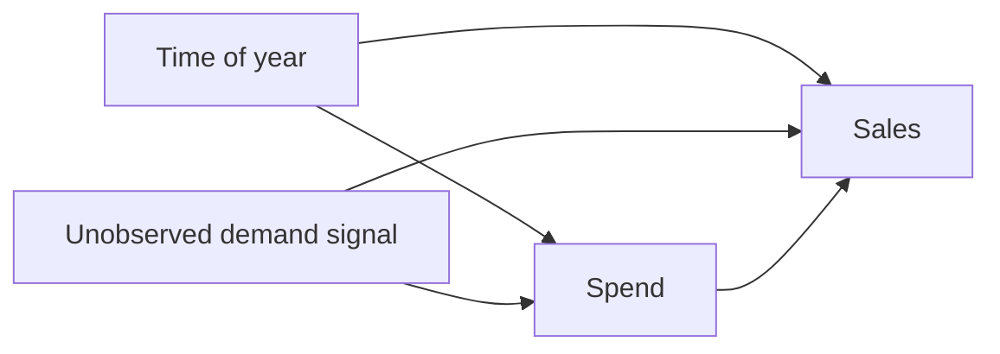
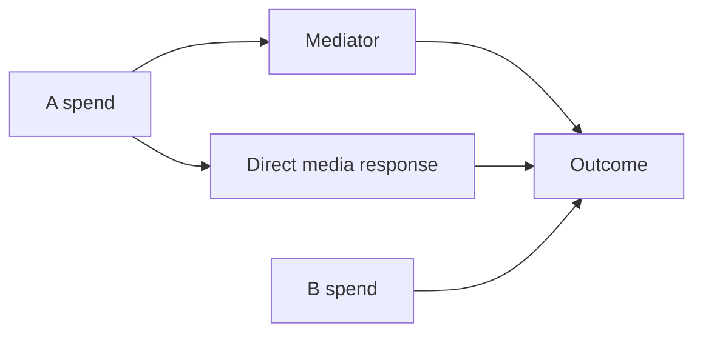

# Budget optimizer: causal and decision-scope audit with reproducible examples

The optimizer solves an allocation problem conditional on its fitted response
graph, supplied inputs, objective, and allowed spending pattern. Those choices
are easy to mistake for a causal forecast of what will happen if we change
spend. I ran small, known-truth examples to identify where the current API
works, where configuration fixes the result, and where it cannot recover the
desired allocation on its own.

**Reproduction:** [experiment code](https://github.com/pymc-labs/pymc-marketing/blob/codex/budget-optimizer-causal-audit/scripts/budget_optimizer_causal_audit/run.py),
[base results](https://github.com/pymc-labs/pymc-marketing/blob/codex/budget-optimizer-causal-audit/scripts/budget_optimizer_causal_audit/results.json),
[PR #3045 price check](https://github.com/pymc-labs/pymc-marketing/blob/codex/budget-optimizer-causal-audit/scripts/budget_optimizer_causal_audit/pr3045_results.json),
and [method and case equations](https://github.com/pymc-labs/pymc-marketing/blob/codex/budget-optimizer-causal-audit/scripts/budget_optimizer_causal_audit/README.md).
Base: `814ad07467c6a983a2ab44deae3014da49ba68b8` (Python 3.12.12,
PyMC 6.3.2, SciPy 1.15.3). Price response: [PR #3045](https://github.com/pymc-labs/pymc-marketing/pull/3045)
at `0faa14cc2c672517e9619eefaa049c3a9cd502ac`. A two-channel grid at
0.01 increments or an analytic solution supplies the independent oracle.
The budget is 10 per period, hence 20 in the two-period cases. *Regret* is
the known response at the relevant oracle plan minus the known response at
the optimizer's plan, in synthetic response units.

| Scenario | Optimizer A/B | Oracle A/B | Regret | Classification |
| --- | ---: | ---: | ---: | --- |
| Additive seasonality | 6.385 / 3.615 | 6.38 / 3.62 | 0 | Works as intended |
| Incorrect future control, log link | 8.724 / 1.276 | 2.34 / 7.66 | 2.668 | Future input assumption; supplying the control gives 0 regret |
| A-driven mediator, channel-only objective | 2.529 / 7.471 | 6.64 / 3.36 | 0.825 | Full-response objective gives 0 regret |
| Uniform weekly spend | 7 / 3 each week | Flexible schedule below | 2.183 | The decision space fixes the weekly pattern |
| Hidden demand affects spend and sales | 10 / 0 | 0 / 10 | 6 | Identification; no optimizer-only fix |
| Spend-dependent price, fixed-price path | 7 / 3 | 4.73 / 5.27 | 0.147 | PR #3045 gives 4.731 / 5.269, 0 regret |

## 1. Seasonality is a conditional causal question



In the additive reference case, the true response is
`baseline[week] + 0.8 log(1+A) + 0.5 log(1+B)`. The baseline changes from 2
to 20, yet the optimizer matches the oracle: a fixed, additive baseline
cancels from the decision. Spending that varies by season is therefore not
automatically a problem.

In the confounded case, A spend also follows an unobserved demand shock that
raises sales. A regression with an *observed season adjustment* gets R²=0.969
but estimates A=1.213 and B=0.548 when the true media coefficients are
A=0.25 and B=0.55. Feeding those fitted coefficients to `BudgetOptimizer`
puts all spend on A; the causal oracle puts it on B. The regression is an OLS
toy used to isolate identification, not an end-to-end fitted `MMM` claim.
Neither `MuEffect` nor a custom optimizer subclass identifies the unblocked
backdoor path.

## 2. Future non-media inputs can change the default objective

For a log link, media contribution on the response scale is
`exp(baseline + media) - exp(baseline)`. It depends on the future baseline.
The two-week example lets A spend in week 1 and B in week 2; its true response
is `(1+2A)^0.6 + 4(1+2B)^0.4`. Treating the week-2 control factor as 1
instead of 4 chooses A=8.724, B=1.276 and loses 2.668 response units.
Supplying the true control chooses A=2.339, B=7.661, matching the oracle.

The standard future model builder currently uses zero for future control
inputs. A direct API inspection with one `promo` control gives:

```python
model = mmm.create_optimization_model("2024-05-20", "2024-06-03")
model["control_data"].get_value().ravel().tolist()
# [0.9, 0.0, 0.0, 0.0, 0.0]
```

The 0.9 is observed carry-in; the next three dates and carry-over date are
zero. This is a valid *scenario* if future promo really is zero. It is an
implicit assumption if the user expected a forecast. Under a purely additive
identity-link model with no interactions, such a fixed control cancels from
the channel allocation, as the first experiment demonstrates.

## 3. Response scope and decision scope



In the known model, A's direct coefficient is 0.25, its mediated coefficient
is 0.8, and B's direct coefficient is 0.6. Directly constructing
`BudgetOptimizer` with `total_media_contribution_original_scale` chooses
A=2.529, B=7.471. Using `total_response_original_scale` chooses A=6.636,
B=3.364 and recovers the oracle. The built-in `MMM.budget_optimizer` does warn
when it detects a media-dependent `MuEffect`; the direct custom-model route
cannot perform that effect-aware check. This example demonstrates an objective
choice, not a failed solver.

The default channel decision repeats a budget level across dates. With known
response weights `[[1, 0.5], [5, 2.5]]` for weeks 1 and 2, the optimizer
chooses `[[7, 3], [7, 3]]`. Allowing the same total money to move across
weeks gives the analytic optimum `[[1.667, 0.333], [12.333, 5.667]]`, worth
2.183 more response units. A supplied `budget_distribution_over_period`
sets a fixed schedule; it does not let the optimizer select one. The optimizer
is correct within its smaller feasible set.

## 4. Pricing is being addressed

When channel A's delivery is `sqrt(2*spend)` and B's is `spend`, the fixed
unit-price path chooses 7 / 3; the known optimum is 4.73 / 5.27. With a model
fitted on delivery units, the `PowerPriceResponse` proposed in PR #3045
chooses 4.731 / 5.269 at the pinned PR commit. This example is included to
show a limitation with an active remedy, not to request duplicate pricing
work.

## Suggested follow-up

1. Make the future exogenous-driver scenario explicit for optimization,
   especially under the log link; document how to provide values and consider
   warning when future controls have been zero-filled.
2. State the optimized decision set prominently: channel/geo budget levels
   plus a fixed date pattern. Consider a separate week-by-channel decision API
   if scheduling is in scope.
3. Document which response variable includes mediated paths and the limits
   of the `MMM` warning for directly constructed custom models.
4. Provide a short causal planning guide: distinguish upstream confounders,
   future exogenous inputs, downstream mediators, and effect modifiers. A
   strong predictive fit alone does not identify `do(spend)` responses.

These examples use fixed one-draw posteriors for optimizer behavior and a
separate fitted linear toy for confounding. They establish mechanisms and
outcomes in the stated scenarios, not their prevalence in real campaigns.

Related work already tracks parts of this space: #2799 requests date-level
budget decisions, #3036 and PR #3045 address spend-dependent prices, and
#3088 discusses driver-level additive and multiplicative composition. This
issue collects decision-focused evidence across those boundaries and raises
the future-input assumption explicitly; it does not request duplicate
implementations of the linked proposals.
